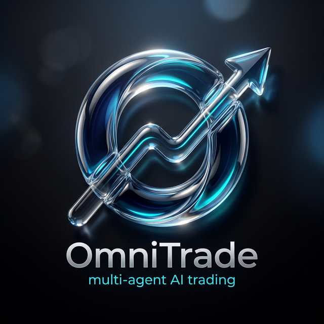

# OmniTrade AI Trading Platform

<div align="center">



[](https://go.dev/)
[](https://react.dev/)
[](./.specswarm/quality-standards.md)
[](./docs/frontend/08_UI_UX_Design_Standards_2026.md)

**OmniTrade** is a next-generation multi-agent AI quantitative trading and research platform. Built with a high-integrity **Three-Plane Architecture** and a premium **Generative & Spatial** interface, it empowers traders with autonomous intelligence and human-in-the-loop safeguards.

[Explore Documentation](./docs) • [Architecture](./docs/architecture/AI_Trading_System_Architecture.md) • [Features](#-key-features) • [Getting Started](#-getting-started)

</div>

---

## 💎 The Vision

OmniTrade represents the convergence of specialized AI intelligence and elite financial research. By orchestrating a **Swarm of 50+ Specialized Agents**, the platform decomposes complex market analysis into verifiable, collaborative reasoning steps, achieving unprecedented token efficiency and decision accuracy.

### 🌌 Generative & Spatial Experience
Our UI follows the **2026 Generative, Spatial, and Neuro-Adaptive Standards**. It’s not just transparent; it’s physics-based. Surfaces simulate refraction, lensing, and dynamic specularity, while the GenUI (Generative UI) assembles components in real-time based on your specific trading intent.

---

## 🛠️ Three-Plane Architecture

OmniTrade is engineered for security and precision:

1.  **📡 Data Plane (Read-Only)**: Real-time ingestion of market OHLCV, SEC filings, and global news. Agents operate via the `medisync_readonly` role, ensuring zero unauthorized mutations.
2.  **🧠 Intelligence Plane**: A Multi-Agent System (MAS) powered by LiteLLM. Specialized analysts (Fundamental, Technical, Sentiment) engage in a "Debate Topology" to reach high-conviction consensus.
3.  **🛡️ Action Plane (HITL)**: The execution layer. AI proposes, human approves. Every trade includes a full **Chain-of-Thought (CoT)** reasoning audit and confidence score.

---

## 🚀 Key Features

### Multi-Agent Intelligence
- **Advanced Debate Topology**: Hierarchical agent structure (Parallel Analysis -> Strategy Optimization -> Synthesis).
- **Universal LLM Integration**: support for OpenAI (GPT-5), Anthropic (Claude 6), Gemini 2.x, DeepSeek-V4, and local inference via **Ollama**.
- **Token Efficiency Engine**: Smart routing and context compression reducing costs by up to 40%.
- **Hallucination Control**: Multi-source validation and cross-checking guardrails.
- **Agent Collaboration Framework**: Formal A2A (Agent-to-Agent) protocols for knowledge distillation and peer review.

### Extensibility & Plugin Systems
- **Claude Code Plugin**: Complete developer experience plugin with commands, agents, skills, hooks, and MCP server integrations
- **Internal Agent Plugin System**: Google ADK-based plugin architecture with hooks, tools registry, and lifecycle management
- **25+ Built-in Tools**: Market data, sentiment analysis, technical indicators, risk assessment, and portfolio management
- **40+ Hook Events**: Complete observability into agent lifecycles with circuit breaker patterns
- **Dify Dashboard**: Central Control Plane for visual plugin, tool, hook, and agent flow management.

### Internationalization
- **Full i18n Support**: Native English (LTR) and Arabic (RTL) capabilities.

---

## 🏗️ Tech Stack

| Component | Technology |
| :--- | :--- |
| **Foundation** | Go 1.26+, `go-chi`, `sqlx`, LiteLLM Gateway |
| **Intelligence** | Google ADK-Go, Multi-Agent Orchestration, Vector RAG (pgvector), Redis Cache |
| **Frontend** | React 19.2, Vite 7.3, Vanilla CSS, CopilotKit, GenUI & Spatial Standards |
| **Plugin Systems** | Claude Code Plugin, Internal Agent Plugin System, MCP Servers (5) |
| **Protocols** | A2A (Agent-to-Agent), MCP (Model Context), ACP (Agent Client) |
| **Observability** | SpecSwarm Quality Gates, Immutable Audit Logs, Circuit Breaker Patterns |

### Google ADK + LiteLLM Integration

The Intelligence Plane is powered by **Google ADK for Go** integrated with **LiteLLM Gateway**:

```
┌─────────────────────────────────────────────────────────────────┐
│                      OmniTrade Intelligence Plane               │
├─────────────────────────────────────────────────────────────────┤
│   ┌─────────────────────────────────────────────────────────┐   │
│   │              Google ADK-Go Agent Layer                   │   │
│   │  ┌─────────────┐  ┌─────────────┐  ┌─────────────┐      │   │
│   │  │ DataFetcher │  │  RAGAgent   │  │ PortfolioMgr│      │   │
│   │  │   Agent     │  │             │  │   Agent     │      │   │
│   │  └─────────────┘  └─────────────┘  └─────────────┘      │   │
│   │         │                │                │              │   │
│   │         └────────────────┼────────────────┘              │   │
│   │                          │                               │   │
│   │  ┌───────────────────────▼───────────────────────┐      │   │
│   │  │           SequentialAgent (Orchestrator)       │      │   │
│   │  └───────────────────────┬───────────────────────┘      │   │
│   └──────────────────────────┼──────────────────────────────┘   │
│                              │                                  │
│   ┌──────────────────────────▼──────────────────────────────┐   │
│   │              LiteLLMModel (implements model.LLM)         │   │
│   │  ┌─────────────────────────────────────────────────┐    │   │
│   │  │  • Converts genai.Content → OpenAI format       │    │   │
│   │  │  • Calls LiteLLM Gateway API                    │    │   │
│   │  │  • Converts OpenAI response → LLMResponse       │    │   │
│   │  │  • Supports SSE streaming for real-time UX      │    │   │
│   │  └─────────────────────────────────────────────────┘    │   │
│   └──────────────────────────┬──────────────────────────────┘   │
│                              │                                  │
│   ┌──────────────────────────▼──────────────────────────────┐   │
│   │                  LiteLLM Gateway                         │   │
│   │  ┌─────────┐ ┌─────────┐ ┌─────────┐ ┌─────────┐       │   │
│   │  │ GPT-5.3 │ │Claude 4│ │Gemini 3 │ │Llama 4  │       │   │
│   │  └─────────┘ └─────────┘ └─────────┘ └─────────┘       │   │
│   └─────────────────────────────────────────────────────────┘   │
└─────────────────────────────────────────────────────────────────┘
```

**Key Components:**
- **`LiteLLMModel`**: Custom ADK model implementing `model.LLM` interface
- **Trading Agents**: DataFetcher, RAGAnalysis, RiskAssessment, PortfolioManager
- **TradingWorkflow**: Orchestrates multi-phase agent execution
- **Tool Adapter**: Wraps OmniTrade tools as ADK-compatible tools

---

## 🤖 Specialized Agent Swarm

OmniTrade utilizes over **50+ specialized trading agents** categorized into expert domains:

### Analysis Agents
- 📊 **Fundamental Analysis**: Valuation models, Growth trends, Forensic accounting
- 📉 **Technical Analysis**: Breakout detection, Volume profiles, Support/Resistance
- 📈 **Market Sentiment**: News synthesis, Social media scraping, Analyst ratings
- 🌍 **Alternative Data**: Geopolitical events, Macro-indicators, Insider tracking

### Meta Agents
- 🧠 **Portfolio Manager**: Synthesizes all inputs, generates trade proposals
- ⚠️ **Risk Manager**: Circuit breaker enforcement, position sizing, VaR calculations
- 🔄 **Debate Orchestrator**: Manages agent disagreements and consensus building

### Plugin-Enabled Architecture
- **Custom Tools**: 25+ built-in tools across 8 categories (market data, sentiment, technical, risk, portfolio, fundamentals, notifications)
- **Hook System**: 40+ lifecycle events for observability and customization
- **Extensible Plugins**: Interface-based plugin system with hot reload and circuit breakers

---

## 🚦 Getting Started

### Prerequisites
- **Go 1.26+**
- **Node.js 22+**
- **Claude Code 1.0.33+** (for Claude Code Plugin)
- **PostgreSQL + pgvector**
- **Docker** (for infrastructure services)

### Local Setup

1. **Clone & Install Dependencies**
   ```bash
   git clone https://github.com/v13478/OmniTrade.git
   cd OmniTrade
   npm install && cd backend && go mod download
   ```

2. **Install Claude Code Plugin**
   ```bash
   # From project root
   claude plugin install ./

   # Or test without installation
   claude --plugin-dir ./
   ```

3. **Build MCP Servers**
   ```bash
   cd mcp
   for server in polygon-market-data sec-filings pgvector-server alpaca-broker financial-news; do
     cd "$server" && npm install && npm run build && cd ..
   done
   ```

4. **Run Infrastructure**
   ```bash
   docker-compose up -d
   ```

5. **Start Development Servers**
   ```bash
   # From root - starts all services
   npm run dev
   ```

### Quick Commands

**Generate Trade Proposal:**
```bash
# Using Claude Code Plugin
/trade:analyze AAPL

# View pending proposals
/trade:status

# Approve trade
/trade:approve <proposal-id>
```

**Agent Orchestration:**
```bash
# List all agents
/agents:list

# Debug Genkit flow
/agents:debug GenerateTradeProposal

# Test agent with mock data
/agents:test technical-analyst mock/AAPL.json
```

**Data Operations:**
```bash
# Check data ingestion status
/data:status

# Connect to WebSocket
/data:connect polygon

# Query historical data
/data:query AAPL 2026-01-01 2026-03-01 --interval 15m
```

---

## 📖 Documentation Index

### Product Documentation
- [Product Requirements (PRD)](./docs/reference/PRD_OmniTrade.md)
- [Agent Intelligence System](./docs/agents/02_Agent_Intelligence_System.md)
- [Liquid Glass Design Specs](./docs/frontend/08_UI_UX_Design_Standards_2026.md)
- [API Specifications](./docs/plans/04_API_Specification.md)
- [Security & HITL Protocol](./docs/plans/05_Security_HITL_Protocol.md)
- [RAG Architecture](./docs/architecture/01_RAG_Architecture_Design.md)
- [Data Ingestion Strategy](./docs/data/03_Data_Ingestion_Strategy.md)
- [Infrastructure Deployment](./docs/plans/06_Infrastructure_Deployment.md)

### Claude Code Plugin Documentation
- [Plugin Architecture](./docs/plugins/architecture.md) - System design and component overview
- [Commands Reference](./docs/plugins/commands.md) - All slash commands (trade, agents, data, dev)
- [Hooks Configuration](./docs/plugins/hooks.md) - Event automation and configuration
- [Agent Definitions](./docs/plugins/agents.md) - Custom agent details (trading-reviewer, risk-analyst, etc.)
- [MCP Integration](./docs/plugins/mcp-integration.md) - MCP server setup (Polygon, SEC, pgvector, Alpaca, News)
- [Quick Start Guide](./docs/plugins/QUICKSTART.md) - 5-minute setup guide
- [Documentation Index](./docs/plugins/index.md) - Navigation for all plugin docs

### Internal Agent Plugin System Documentation
- [Plugin Development Guide](./docs/plugins/internal/plugin-development-guide.md) - How to create plugins
- [Tool Reference](./docs/plugins/internal/tool-reference.md) - All 25+ tools documented
- [Hooks Reference](./docs/plugins/internal/hooks-reference.md) - Complete hooks reference (40+ events)
- [System Architecture](./docs/plugins/internal/architecture.md) - Complete system architecture
- [Examples](./docs/plugins/internal/examples/) - Code examples for plugins, tools, and hooks
- [Troubleshooting](./docs/plugins/internal/troubleshooting.md) - Common issues and solutions

---

## 📋 Quality Standards (SpecSwarm)

We maintain strict quality gates enforced by **SpecSwarm**:

| Metric | Threshold |
| :--- | :--- |
| **Test Coverage** | 90% Minimum |
| **Quality Score** | 90/100 Minimum |
| **Security** | Zero Critical Vulnerabilities |
| **Plugin Performance** | < 40ms INP (Interaction to Next Paint) |
| **Circuit Breaker** | 5 failures/60s triggers auto-disable |

---

## 🔌 Plugin Ecosystem

### Claude Code Plugin (Developer Experience)
Extends Claude Code with specialized capabilities for OmniTrade development:

| Component | Count | Description |
|-----------|-------|-------------|
| **Commands** | 4 | `/trade:*`, `/agents:*`, `/data:*`, `/dev:*` |
| **Agents** | 4 | Trading Reviewer, Risk Analyst, Flow Debugger, Frontend Architect |
| **Skills** | 10 | Financial rules, Genkit flows, Debate topology, etc. |
| **MCP Servers** | 5 | Polygon, SEC, pgvector, Alpaca, Financial News |
| **Hooks** | 6 | Auto-format, lint, logging, etc. |

**Location:** `.claude-plugin/`, `commands/`, `agents/`, `.claude/skills/`

**Documentation:** [docs/plugins/](./docs/plugins/)

### Internal Agent Plugin System (Application)
Google ADK-based plugin architecture for the application's AI agents:

| Component | Files | Description |
|-----------|-------|-------------|
| **Hooks System** | 6 | 40+ events, priority execution, 10 middlewares |
| **Plugins System** | 5 | Lifecycle management, hot reload, circuit breakers |
| **Tools Registry** | 12 | 25+ tools across 8 categories |
| **Google ADK** | 6 | Agent creation, tool wrapping, flow definitions |
| **Dify UI** | N/A | Central Control Plane for agent flow management |

**Location:** `backend/internal/agent/`, `frontend/src/plugins/`

**Documentation:** [docs/plugins/internal/](./docs/plugins/internal/)

---

## 🎨 Design System

OmniTrade follows the authoritative **2026 Standard for Generative, Spatial, and Neuro-Adaptive Systems**:

1.  **Generative UI (GenUI)**: Intent-driven assembly. The "Zero-State Void" starts with an Omni-input bar, generating components only when needed.
2.  **Visual System (Photon Physics)**: Ray-traced shadows, sub-surface scattering (SSS) for "organic" interactive elements, and refractive indexing for depth.
3.  **Neuro-Adaptive Interfaces**: Real-time calibration to cognitive load. Includes foveated UI (eye-tracking optimization) and hesitation-triggered task decomposition.
4.  **Accessibility (WCAG 3.0 & APCA)**: Utilizing the Advanced Perceptual Contrast Algorithm (Lc 75/60) and HRTF-compliant Spatial Audio signatures.
5.  **Quantum Performance**: < 40ms INP target with predictive hydration (Local-First CRDTs) and Edge-Assembly for zero-latency interactions.
6.  **Sustainable UI**: Energy-efficient sub-pixel culling and "Eco-Fidelity" tracking for carbon-conscious rendering.
7.  **Trust & Transparency**: C2PA Metadata Badging ($\diamondsuit$) for all AI-generated components and an Emotional Transparency Shield.

**Full Specification:** [docs/frontend/08_UI_UX_Design_Standards_2026.md](./docs/frontend/08_UI_UX_Design_Standards_2026.md)

---

## 🤝 Contributing

We welcome contributions! Please see:
- [Contributing Guidelines](./CONTRIBUTING.md)
- [Plugin Development Guide](./docs/plugins/internal/plugin-development-guide.md)
- [Code of Conduct](./CODE_OF_CONDUCT.md)

## 📜 License

This project is licensed under the MIT License - see the [LICENSE](LICENSE) file for details.

## 🙏 Acknowledgments

Built with ❤️ by the OmniTrade Core Team

**Inspired by:**
- [HKUDS/AI-Trader](https://github.com/HKUDS/AI-Trader) - MCP toolchain architecture
- [virattt/ai-hedge-fund](https://github.com/virattt/ai-hedge-fund) - Multi-agent patterns
- [FinRobot](https://github.com/AI4Finance-Foundation/FinRobot) - Four-layer architecture
- [QLib](https://github.com/microsoft/qlib) - Tool organization patterns
- [12-Factor Agents](https://github.com/humanlayer/12-factor-agents) - Production agent design
- [Google ADK](https://github.com/google/adk-go) - Agent development kit

**Built With:**
- Go 1.26+ | React 19.2 | Google Genkit | Google ADK | PostgreSQL + pgvector | Redis
- Claude Code | MCP (Model Context Protocol) | Liquid Glass Design System

LiteLLM RAG:
{
  "mcpServers": {
    "omnitrade-gateway": {
      "command": "npx",
      "args": [
        "litellm-agent-mcp",
        "--base_url", "http://localhost:4000",
        "--api_key", "sk-omnitrade-master-key"
      ]
    }
  }
}
