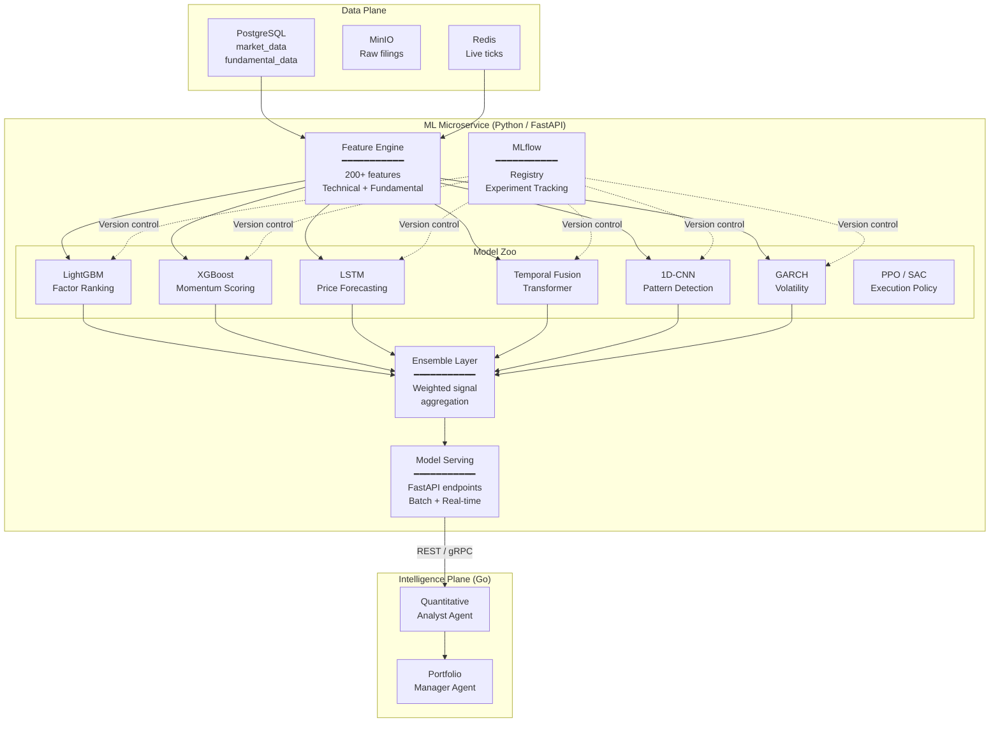
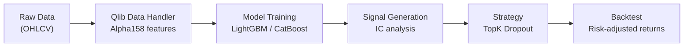
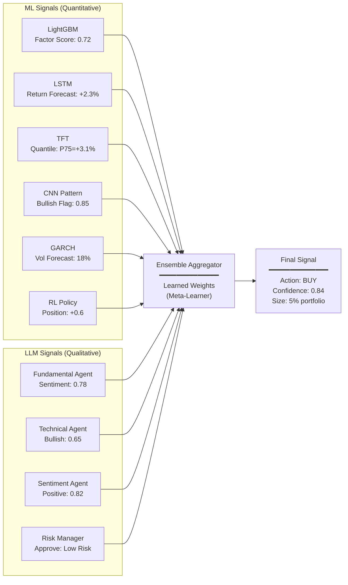
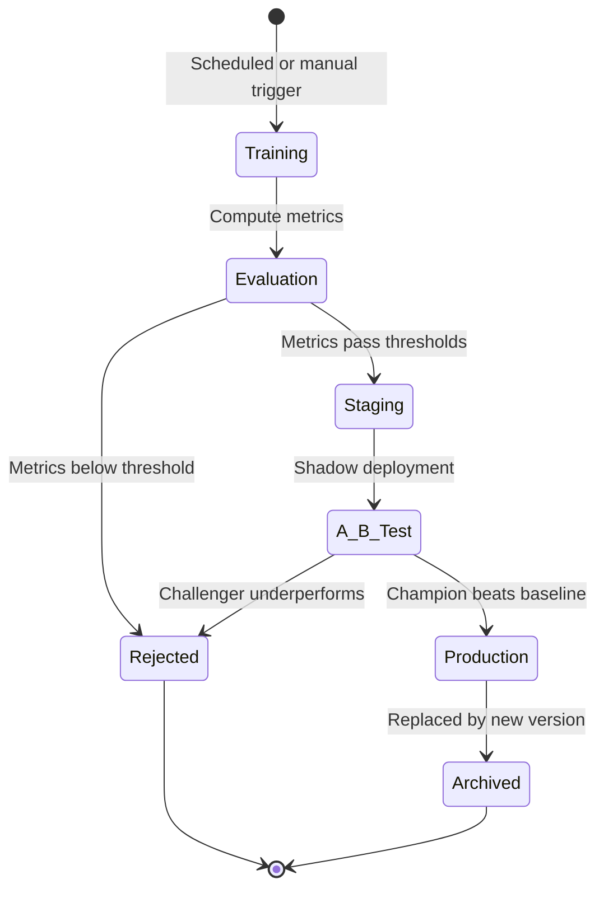
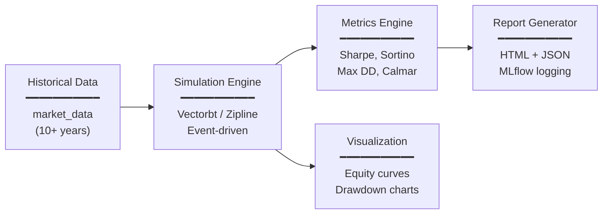
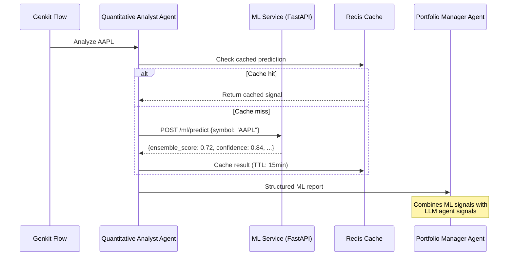
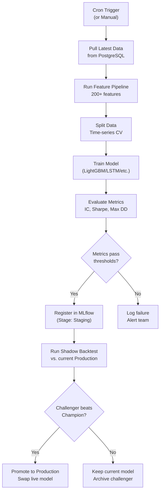

# OmniTrade: Machine Learning & Quantitative Models Specification

> **Version:** 1.0 · **Date:** 2026-03-04 · **Status:** Living Document

---

## Table of Contents

1. [Executive Summary](#1-executive-summary)
2. [ML Architecture Overview](#2-ml-architecture-overview)
3. [Feature Engineering Pipeline](#3-feature-engineering-pipeline)
4. [Supervised Learning Models](#4-supervised-learning-models)
5. [Deep Learning Models](#5-deep-learning-models)
6. [Reinforcement Learning Models](#6-reinforcement-learning-models)
7. [Ensemble & Signal Aggregation](#7-ensemble--signal-aggregation)
8. [Model Training Infrastructure](#8-model-training-infrastructure)
9. [Model Registry & Versioning](#9-model-registry--versioning)
10. [Backtesting Framework](#10-backtesting-framework)
11. [Model Serving & Inference](#11-model-serving--inference)
12. [Database Schema Extensions](#12-database-schema-extensions)
13. [Integration with AI Agent System](#13-integration-with-ai-agent-system)
14. [Open-Source Technology Stack](#14-open-source-technology-stack)
15. [Training & Deployment Workflows](#15-training--deployment-workflows)

---

## 1. Executive Summary

OmniTrade's Intelligence Plane currently relies on **LLM-based agents** for qualitative analysis (sentiment, fundamental reasoning, debate topology). However, the platform critically lacks **quantitative machine learning models** — the backbone of modern algorithmic trading. This document specifies the complete ML/DL model pipeline from raw market data to actionable quantitative signals.

### What's Missing Today

| Capability | Current State | Target State |
|:-----------|:-------------|:-------------|
| Price forecasting | None | LSTM, Temporal Fusion Transformers |
| Factor ranking | Referenced (Qlib) but unspecified | LightGBM, XGBoost factor models |
| Pattern recognition | LLM-based (imprecise) | CNN-based chart pattern detection |
| Volatility prediction | None | GARCH + Neural GARCH models |
| Intraday execution | Referenced (RL) but unspecified | PPO/SAC reinforcement learning |
| Feature engineering | None | 200+ technical/fundamental features |
| Backtesting | None | Full historical simulation engine |
| Model versioning | None | MLflow registry with A/B testing |
| Experiment tracking | None | MLflow + DVC pipelines |

### Design Principles

1. **All open-source** — PyTorch, scikit-learn, LightGBM, Qlib, MLflow
2. **Python ML microservice** — ML models run in a dedicated Python service (FastAPI), separate from the Go backend
3. **Go backend orchestrates** — The Go service calls the Python ML service via REST/gRPC, combining ML signals with LLM agent signals
4. **Offline training, online inference** — Models are trained on scheduled batch jobs, served via a low-latency inference API

---

## 2. ML Architecture Overview



---

## 3. Feature Engineering Pipeline

### 3.1 Technical Features (from `market_data`)

All features are computed from OHLCV data using **TA-Lib** (open-source, BSD license) and **pandas-ta**.

| Category | Features | Window Sizes |
|:---------|:---------|:-------------|
| **Trend** | SMA, EMA, WMA, DEMA, TEMA, VWAP | 5, 10, 20, 50, 100, 200 |
| **Momentum** | RSI, Stochastic RSI, MACD (signal + histogram), ROC, Williams %R, CCI, CMO | 9, 14, 26 |
| **Volatility** | Bollinger Bands (width + %B), ATR, Keltner Channels, Donchian Channels, Historical Vol | 14, 20 |
| **Volume** | OBV, VWAP deviation, A/D Line, CMF, MFI, Volume SMA ratio | 10, 20 |
| **Pattern** | Candlestick patterns (Doji, Hammer, Engulfing, etc.) via TA-Lib | — |
| **Price Action** | Support/Resistance levels, pivot points, Fibonacci retracements | — |
| **Cross-Asset** | Sector-relative strength, S&P 500 beta, VIX correlation | 20, 60 |

### 3.2 Fundamental Features (from `fundamental_data` + RAG)

| Feature | Source | Update Frequency |
|:--------|:-------|:----------------|
| P/E Ratio (TTM) | SEC 10-K/10-Q | Quarterly |
| P/S Ratio | SEC filings | Quarterly |
| P/B Ratio | SEC filings | Quarterly |
| EV/EBITDA | SEC filings | Quarterly |
| Revenue growth (YoY, QoQ) | SEC filings | Quarterly |
| Gross margin, Net margin | SEC filings | Quarterly |
| Debt-to-Equity | SEC filings | Quarterly |
| Free cash flow yield | SEC filings | Quarterly |
| Insider buying/selling ratio | SEC Form 4 | Daily |
| Analyst consensus score | Financial News MCP | Daily |
| Earnings surprise % | Financial News MCP | Quarterly |

### 3.3 Alternative / Sentiment Features

| Feature | Source | Update Frequency |
|:--------|:-------|:----------------|
| News sentiment score | Financial News MCP | Hourly |
| Social media mention velocity | External API / scraping | Hourly |
| Fear & Greed Index | Computed composite | Daily |
| VIX level & change | Polygon.io MCP | Real-time |
| Fed Funds Rate delta | FRED API | Monthly |
| CPI/Inflation rate | FRED API | Monthly |
| Sector rotation score | Computed from relative strength | Weekly |

### 3.4 Feature Store Schema

```sql
CREATE TABLE ml_features (
    id BIGSERIAL PRIMARY KEY,
    symbol VARCHAR(10) NOT NULL,
    feature_date TIMESTAMPTZ NOT NULL,
    feature_set JSONB NOT NULL,       -- All 200+ features as key-value pairs
    feature_version VARCHAR(20),       -- Feature pipeline version
    created_at TIMESTAMPTZ DEFAULT NOW(),
    UNIQUE(symbol, feature_date, feature_version)
);

CREATE INDEX idx_ml_features_symbol_date ON ml_features(symbol, feature_date DESC);
```

---

## 4. Supervised Learning Models

### 4.1 LightGBM — Factor Ranking Model

**Purpose:** Rank stocks by alpha potential for mid-term value investing (Qlib-style pipeline).

| Parameter | Value |
|:----------|:------|
| **Framework** | LightGBM (Microsoft, MIT license) |
| **Task** | Regression (predict N-day forward returns) |
| **Target** | 5-day, 20-day, and 60-day forward returns |
| **Features** | 150+ (technical + fundamental + sentiment) |
| **Training Data** | 10 years of daily OHLCV + quarterly fundamentals |
| **Validation** | Time-series split (expanding window, no future leakage) |
| **Retraining** | Weekly (Sunday batch job) |
| **Key Hyperparameters** | `num_leaves=63`, `learning_rate=0.05`, `n_estimators=1000`, `early_stopping=50` |

```python
# models/factor_ranking.py
import lightgbm as lgb
from sklearn.model_selection import TimeSeriesSplit

class FactorRankingModel:
    def __init__(self):
        self.model = lgb.LGBMRegressor(
            num_leaves=63,
            learning_rate=0.05,
            n_estimators=1000,
            subsample=0.8,
            colsample_bytree=0.8,
            reg_alpha=0.1,
            reg_lambda=0.1,
            random_state=42,
        )

    def train(self, X_train, y_train, X_val, y_val):
        self.model.fit(
            X_train, y_train,
            eval_set=[(X_val, y_val)],
            callbacks=[lgb.early_stopping(50), lgb.log_evaluation(100)],
        )

    def predict(self, X) -> np.ndarray:
        return self.model.predict(X)

    def feature_importance(self) -> dict:
        return dict(zip(
            self.model.feature_name_,
            self.model.feature_importances_
        ))
```

### 4.2 XGBoost — Momentum Scoring Model

**Purpose:** Short-term momentum classification for event-driven strategies.

| Parameter | Value |
|:----------|:------|
| **Framework** | XGBoost (Apache 2.0 license) |
| **Task** | Binary classification (UP/DOWN next-day) |
| **Target** | Next-day return direction |
| **Features** | 80+ (technical indicators + intraday volume profiles) |
| **Training Data** | 5 years of daily data |
| **Retraining** | Daily (post-market close) |

### 4.3 Qlib Integration — Quantitative Research Framework

**Purpose:** End-to-end quantitative research pipeline (Microsoft, MIT license).



| Component | Qlib Module | Purpose |
|:----------|:-----------|:--------|
| Data | `qlib.data` | Alpha158 feature set (158 pre-computed factors) |
| Model | `qlib.contrib.model` | LightGBM, CatBoost, TabNet, LSTM |
| Signal | `qlib.contrib.strategy` | TopK selection, weight optimization |
| Backtest | `qlib.backtest` | Historical simulation with transaction costs |
| Analysis | `qlib.contrib.report` | IC, ICIR, Sharpe ratio, max drawdown |

---

## 5. Deep Learning Models

### 5.1 LSTM — Price Sequence Forecasting

**Purpose:** Capture temporal dependencies in price sequences for short-to-mid-term forecasting.

| Parameter | Value |
|:----------|:------|
| **Framework** | PyTorch (BSD, Meta) |
| **Architecture** | 2-layer Bi-LSTM with attention |
| **Input** | Sliding window of 60 days × 30 features |
| **Output** | 5-day ahead price return prediction |
| **Training** | Walk-forward validation (retrain monthly) |
| **GPU** | Optional (CUDA via Ollama's GPU or dedicated) |

```python
# models/lstm_forecast.py
import torch
import torch.nn as nn

class LSTMForecaster(nn.Module):
    def __init__(self, input_dim=30, hidden_dim=128, num_layers=2, dropout=0.2):
        super().__init__()
        self.lstm = nn.LSTM(
            input_dim, hidden_dim, num_layers,
            batch_first=True, dropout=dropout, bidirectional=True,
        )
        self.attention = nn.MultiheadAttention(hidden_dim * 2, num_heads=4)
        self.fc = nn.Sequential(
            nn.Linear(hidden_dim * 2, 64),
            nn.ReLU(),
            nn.Dropout(dropout),
            nn.Linear(64, 1),       # predict return
        )

    def forward(self, x):
        lstm_out, _ = self.lstm(x)                          # (B, T, 2*H)
        attn_out, _ = self.attention(lstm_out, lstm_out, lstm_out)
        pooled = attn_out[:, -1, :]                         # last timestep
        return self.fc(pooled)
```

### 5.2 Temporal Fusion Transformer (TFT)

**Purpose:** State-of-the-art multi-horizon forecasting with interpretable attention.

| Parameter | Value |
|:----------|:------|
| **Framework** | PyTorch + pytorch-forecasting (MIT) |
| **Architecture** | Temporal Fusion Transformer (Google Research) |
| **Input** | 120-day history + known future inputs (calendar, scheduled events) |
| **Output** | Multi-horizon quantile forecasts (1d, 5d, 20d) |
| **Key Feature** | Variable selection networks + interpretable multi-head attention |
| **Static Covariates** | Sector, market cap category, exchange |
| **Time-Varying Known** | Day-of-week, month, earnings date flag, FOMC meeting flag |
| **Time-Varying Unknown** | Price, volume, RSI, MACD, sentiment score |

```python
# models/tft_forecast.py
from pytorch_forecasting import TemporalFusionTransformer
from pytorch_forecasting.data import TimeSeriesDataSet

training = TimeSeriesDataSet(
    data,
    time_idx="time_idx",
    target="returns",
    group_ids=["symbol"],
    max_encoder_length=120,
    max_prediction_length=20,
    static_categoricals=["sector", "market_cap_bucket"],
    time_varying_known_reals=["day_of_week", "month", "earnings_flag"],
    time_varying_unknown_reals=["close", "volume", "rsi_14", "macd", "sentiment"],
    target_normalizer=GroupNormalizer(groups=["symbol"]),
)

model = TemporalFusionTransformer.from_dataset(
    training,
    hidden_size=64,
    attention_head_size=4,
    dropout=0.1,
    hidden_continuous_size=16,
    loss=QuantileLoss(),
    learning_rate=1e-3,
)
```

### 5.3 1D-CNN — Chart Pattern Recognition

**Purpose:** Detect technical chart patterns (head-and-shoulders, double top/bottom, flags) from raw OHLCV sequences.

| Parameter | Value |
|:----------|:------|
| **Framework** | PyTorch |
| **Architecture** | Multi-scale 1D-CNN with residual blocks |
| **Input** | 100-day OHLCV candles (5 channels) |
| **Output** | Pattern classification (12 patterns + "no pattern") |
| **Training Data** | Synthetically generated + manually labeled historical patterns |

### 5.4 Neural GARCH — Volatility Forecasting

**Purpose:** Predict future volatility for position sizing and stop-loss optimization.

| Parameter | Value |
|:----------|:------|
| **Framework** | PyTorch + ARCH library (Kevin Sheppard, BSD) |
| **Architecture** | Hybrid: Classical GARCH(1,1) + Neural network residual correction |
| **Input** | Log returns, realized volatility, VIX |
| **Output** | 1-day, 5-day, 20-day volatility forecast |
| **Use Case** | Risk Manager agent uses this for dynamic position sizing |

---

## 6. Reinforcement Learning Models

### 6.1 PPO — Intraday Execution Policy

**Purpose:** Optimize order execution timing and position sizing for intraday commodity trading (Gold, Silver, Oil).

| Parameter | Value |
|:----------|:------|
| **Framework** | Stable-Baselines3 (MIT license) |
| **Algorithm** | Proximal Policy Optimization (PPO) |
| **Environment** | Custom `gym.Env` built on historical tick data |
| **State Space** | Order book L2, 1-min OHLCV, position, P&L, time-of-day |
| **Action Space** | Continuous: position size [-1, 1] (short to long) |
| **Reward** | Risk-adjusted P&L (Sharpe-scaled returns) |
| **Training** | 3 years of 1-minute commodity data |

```python
# models/rl_execution.py
import gymnasium as gym
import numpy as np
from stable_baselines3 import PPO

class TradingEnv(gym.Env):
    def __init__(self, data, initial_balance=100000):
        super().__init__()
        self.data = data
        self.initial_balance = initial_balance

        # State: [price_features(20), position(1), balance(1), time_features(3)]
        self.observation_space = gym.spaces.Box(
            low=-np.inf, high=np.inf, shape=(25,), dtype=np.float32
        )
        # Action: target position as fraction of portfolio [-1, 1]
        self.action_space = gym.spaces.Box(
            low=-1.0, high=1.0, shape=(1,), dtype=np.float32
        )

    def step(self, action):
        # Execute action, calculate reward (risk-adjusted return)
        ...

    def reset(self, **kwargs):
        # Reset to random starting point in historical data
        ...

# Training
model = PPO(
    "MlpPolicy", TradingEnv(training_data),
    learning_rate=3e-4,
    n_steps=2048,
    batch_size=64,
    n_epochs=10,
    gamma=0.99,
    verbose=1,
)
model.learn(total_timesteps=1_000_000)
```

### 6.2 SAC — Portfolio Allocation Policy

**Purpose:** Learn optimal portfolio allocation across multiple assets considering risk-return tradeoffs.

| Parameter | Value |
|:----------|:------|
| **Algorithm** | Soft Actor-Critic (SAC) — better for continuous action spaces |
| **Action Space** | Portfolio weight vector across N assets |
| **State** | Factor scores + current holdings + market regime |
| **Reward** | Differential Sharpe Ratio (online Sharpe computation) |

---

## 7. Ensemble & Signal Aggregation

### 7.1 Signal Combination Strategy

The ML models produce **quantitative signals** that are combined with **LLM agent signals** in the Portfolio Manager.



### 7.2 Meta-Learner (Stacking)

A lightweight **logistic regression meta-learner** (or gradient-boosted meta-learner) learns the optimal weights for combining ML + LLM signals using historical performance.

```python
# models/meta_learner.py
from sklearn.linear_model import LogisticRegressionCV

class SignalMetaLearner:
    """Learns optimal weights for combining ML + LLM signals."""

    def __init__(self):
        self.meta_model = LogisticRegressionCV(
            cv=TimeSeriesSplit(n_splits=5),
            scoring="roc_auc",
            max_iter=1000,
        )

    def train(self, signal_matrix, actual_outcomes):
        """
        signal_matrix: DataFrame with columns for each model's signal
        actual_outcomes: binary (1 = profitable trade, 0 = loss)
        """
        self.meta_model.fit(signal_matrix, actual_outcomes)

    def predict_confidence(self, signals) -> float:
        """Returns aggregated confidence score [0, 1]."""
        return self.meta_model.predict_proba(signals.reshape(1, -1))[0, 1]

    @property
    def signal_weights(self) -> dict:
        """Returns learned weight per signal source."""
        return dict(zip(self.feature_names, self.meta_model.coef_[0]))
```

---

## 8. Model Training Infrastructure

### 8.1 ML Microservice Architecture

```
ml-service/                        # Python / FastAPI microservice
├── pyproject.toml                 # Dependencies (uv/poetry)
├── Dockerfile
├── src/
│   ├── main.py                    # FastAPI app entry point
│   ├── api/
│   │   ├── routes.py              # REST endpoints for predictions
│   │   └── schemas.py             # Pydantic request/response models
│   ├── features/
│   │   ├── engine.py              # Feature engineering pipeline
│   │   ├── technical.py           # TA-Lib indicators
│   │   ├── fundamental.py         # Fundamental ratios
│   │   └── store.py               # Feature store read/write
│   ├── models/
│   │   ├── factor_ranking.py      # LightGBM
│   │   ├── momentum.py            # XGBoost
│   │   ├── lstm_forecast.py       # LSTM
│   │   ├── tft_forecast.py        # Temporal Fusion Transformer
│   │   ├── pattern_cnn.py         # 1D-CNN
│   │   ├── volatility.py          # GARCH + Neural GARCH
│   │   ├── rl_execution.py        # PPO
│   │   ├── rl_allocation.py       # SAC
│   │   └── meta_learner.py        # Signal ensemble
│   ├── training/
│   │   ├── trainer.py             # Training orchestration
│   │   ├── scheduler.py           # Cron-based retraining
│   │   └── evaluation.py          # Metrics computation
│   ├── serving/
│   │   ├── inference.py           # Model loading & prediction
│   │   └── cache.py               # Redis prediction caching
│   └── config.py                  # Configuration
├── experiments/                   # MLflow experiment configs
├── data/                          # DVC-tracked datasets
└── tests/
```

### 8.2 Docker Compose Addition

```yaml
  ml-service:
    build: ./ml-service
    depends_on:
      db: { condition: service_healthy }
    environment:
      DATABASE_URL: "postgres://omnitrade:${DB_PASSWORD}@db:5432/omnitrade"
      REDIS_URL: "redis://redis:6379"
      MLFLOW_TRACKING_URI: "http://mlflow:5000"
      MODEL_STORE_PATH: "/models"
    volumes:
      - ml_models:/models
    ports:
      - "8000:8000"
    labels:
      - "traefik.http.routers.ml.rule=PathPrefix(`/ml`)"
    # GPU support (uncomment for NVIDIA)
    # deploy:
    #   resources:
    #     reservations:
    #       devices:
    #         - driver: nvidia
    #           count: 1
    #           capabilities: [gpu]

  mlflow:
    image: ghcr.io/mlflow/mlflow:v2.20.0
    command: mlflow server --host 0.0.0.0 --port 5000 --backend-store-uri postgresql://omnitrade:${DB_PASSWORD}@db:5432/mlflow --default-artifact-root /mlflow-artifacts
    depends_on:
      db: { condition: service_healthy }
    ports:
      - "5000:5000"
    volumes:
      - mlflow_artifacts:/mlflow-artifacts
```

### 8.3 Training Schedule

| Model | Retraining Frequency | Data Window | Compute Time |
|:------|:--------------------|:------------|:-------------|
| LightGBM (Factor) | Weekly (Sunday) | 10 years daily | ~5 min (CPU) |
| XGBoost (Momentum) | Daily (post-market) | 5 years daily | ~2 min (CPU) |
| LSTM | Monthly | 5 years daily | ~30 min (GPU) |
| TFT | Monthly | 5 years daily | ~1 hour (GPU) |
| 1D-CNN (Patterns) | Quarterly | 15 years daily | ~2 hours (GPU) |
| GARCH | Weekly | 3 years daily | ~1 min (CPU) |
| PPO (Execution) | Monthly | 3 years 1-min data | ~4 hours (GPU) |
| SAC (Allocation) | Monthly | 5 years daily | ~2 hours (GPU) |
| Meta-Learner | Weekly | 1 year of signal history | ~10 sec (CPU) |

---

## 9. Model Registry & Versioning

### 9.1 MLflow Model Registry

| Component | Technology | Purpose |
|:----------|:-----------|:--------|
| Experiment Tracking | **MLflow** (Apache 2.0) | Log hyperparameters, metrics, artifacts |
| Model Registry | **MLflow Model Registry** | Version models, stage transitions (Staging → Production) |
| Data Versioning | **DVC** (Apache 2.0) | Track training datasets and feature pipelines |
| Artifact Storage | **MinIO** | Store serialized models (`.joblib`, `.pt`, `.onnx`) |

### 9.2 Model Lifecycle



### 9.3 Promotion Criteria

| Metric | LightGBM/XGBoost | LSTM/TFT | RL |
|:-------|:-----------------|:---------|:---|
| **Min IC** (Information Coefficient) | > 0.03 | > 0.02 | N/A |
| **Min Sharpe (backtest)** | > 1.0 | > 0.8 | > 1.5 |
| **Max Drawdown** | < 15% | < 20% | < 10% |
| **Directional Accuracy** | > 53% | > 52% | N/A |
| **Walk-Forward Stability** | CV std < 0.02 | CV std < 0.03 | N/A |

---

## 10. Backtesting Framework

### 10.1 Architecture



### 10.2 Technology Choice

| Framework | License | Purpose |
|:----------|:--------|:--------|
| **Vectorbt** | Apache 2.0 | High-performance vectorized backtesting |
| **Zipline-reloaded** | Apache 2.0 | Event-driven backtesting (alternative) |
| **Quantstats** | MIT | Performance analytics and tear sheets |
| **PyFolio** | Apache 2.0 | Risk/return analysis (Quantopian heritage) |

### 10.3 Backtest Configuration

```python
# backtesting/config.py
@dataclass
class BacktestConfig:
    start_date: str = "2016-01-01"
    end_date: str = "2025-12-31"
    initial_capital: float = 1_000_000.0
    commission_bps: float = 5.0           # 5 basis points per trade
    slippage_bps: float = 2.0             # 2 basis points slippage
    max_position_pct: float = 0.10        # 10% max single position
    max_sector_pct: float = 0.25          # 25% max sector exposure
    rebalance_freq: str = "weekly"         # daily, weekly, monthly
    benchmark: str = "SPY"                 # S&P 500 benchmark
```

### 10.4 Key Metrics Computed

| Metric | Description |
|:-------|:------------|
| **CAGR** | Compound Annual Growth Rate |
| **Sharpe Ratio** | Risk-adjusted return (annualized) |
| **Sortino Ratio** | Downside-risk-adjusted return |
| **Max Drawdown** | Largest peak-to-trough decline |
| **Calmar Ratio** | CAGR / Max Drawdown |
| **Win Rate** | % of profitable trades |
| **Profit Factor** | Gross profit / Gross loss |
| **Information Coefficient (IC)** | Correlation of predicted vs actual rankings |
| **Turnover** | Average portfolio turnover per rebalance |

---

## 11. Model Serving & Inference

### 11.1 FastAPI Endpoints

```python
# api/routes.py
from fastapi import FastAPI, HTTPException
from pydantic import BaseModel

app = FastAPI(title="OmniTrade ML Service", version="1.0.0")

class PredictionRequest(BaseModel):
    symbol: str
    horizon: str = "5d"            # 1d, 5d, 20d, 60d
    include_features: bool = False

class PredictionResponse(BaseModel):
    symbol: str
    timestamp: str
    predictions: dict               # model_name -> prediction
    ensemble_score: float            # aggregated signal [-1, 1]
    confidence: float                # meta-learner confidence [0, 1]
    features: dict | None = None

@app.post("/ml/predict", response_model=PredictionResponse)
async def predict(request: PredictionRequest):
    """Generate ML predictions for a symbol."""
    ...

@app.post("/ml/predict/batch")
async def predict_batch(symbols: list[str]):
    """Batch predictions for portfolio screening."""
    ...

@app.get("/ml/models")
async def list_models():
    """List all deployed models with versions and metrics."""
    ...

@app.get("/ml/models/{model_name}/importance")
async def feature_importance(model_name: str):
    """Get feature importance for a specific model."""
    ...

@app.post("/ml/backtest")
async def run_backtest(config: BacktestConfig):
    """Run a backtest with specified parameters."""
    ...

@app.get("/ml/health")
async def health():
    """ML service health check."""
    ...
```

### 11.2 Inference Optimization

| Technique | Purpose |
|:----------|:--------|
| **ONNX Runtime** | Export PyTorch models to ONNX for ~3x faster inference |
| **Redis Caching** | Cache predictions per symbol with TTL (15 min intraday, 24h daily) |
| **Batch Inference** | Nightly batch prediction for all tracked symbols |
| **Model Preloading** | All production models loaded into memory at service startup |

---

## 12. Database Schema Extensions

### 12.1 New Tables for ML

```sql
-- Store ML model predictions
CREATE TABLE ml_predictions (
    id BIGSERIAL PRIMARY KEY,
    symbol VARCHAR(10) NOT NULL,
    model_name VARCHAR(50) NOT NULL,     -- e.g., 'lightgbm_factor_v2'
    model_version VARCHAR(20) NOT NULL,
    prediction_date TIMESTAMPTZ NOT NULL,
    horizon VARCHAR(10) NOT NULL,         -- '1d', '5d', '20d', '60d'
    prediction DECIMAL(10, 6),            -- predicted return or score
    confidence DECIMAL(5, 4),             -- model confidence
    metadata JSONB,                       -- feature importances, etc.
    created_at TIMESTAMPTZ DEFAULT NOW(),
    UNIQUE(symbol, model_name, prediction_date, horizon)
);

-- Store ML model metadata (MLflow mirror for fast queries)
CREATE TABLE ml_model_registry (
    id UUID PRIMARY KEY DEFAULT gen_random_uuid(),
    model_name VARCHAR(50) NOT NULL,
    version VARCHAR(20) NOT NULL,
    stage VARCHAR(20) DEFAULT 'staging',  -- staging, production, archived
    framework VARCHAR(20),                -- lightgbm, pytorch, sklearn
    metrics JSONB,                        -- sharpe, ic, max_dd, etc.
    hyperparameters JSONB,
    artifact_path VARCHAR(255),           -- MinIO path to serialized model
    training_date TIMESTAMPTZ,
    created_at TIMESTAMPTZ DEFAULT NOW(),
    UNIQUE(model_name, version)
);

-- Store backtest results
CREATE TABLE ml_backtest_results (
    id UUID PRIMARY KEY DEFAULT gen_random_uuid(),
    model_name VARCHAR(50) NOT NULL,
    model_version VARCHAR(20) NOT NULL,
    config JSONB NOT NULL,                -- backtest configuration
    metrics JSONB NOT NULL,               -- sharpe, cagr, max_dd, etc.
    equity_curve JSONB,                   -- daily equity values
    trade_log JSONB,                      -- individual trade records
    started_at TIMESTAMPTZ,
    completed_at TIMESTAMPTZ,
    created_at TIMESTAMPTZ DEFAULT NOW()
);

-- Indexes
CREATE INDEX idx_ml_pred_symbol ON ml_predictions(symbol, prediction_date DESC);
CREATE INDEX idx_ml_pred_model ON ml_predictions(model_name, prediction_date DESC);
CREATE INDEX idx_ml_registry_stage ON ml_model_registry(stage, model_name);
```

---

## 13. Integration with AI Agent System

### 13.1 How ML Models Feed into Genkit Agents



### 13.2 Quantitative Analyst Agent — Updated Spec

The `quantitative_analyst` agent is upgraded from a pure LLM agent to a **hybrid agent** that calls the ML service:

```python
# Agent tool definition (registered in Genkit)
{
    "name": "GetMLPrediction",
    "description": "Get quantitative ML model predictions for a stock symbol",
    "input_schema": {
        "symbol": "string",
        "horizon": "string",       # 1d, 5d, 20d, 60d
        "models": ["string"]       # optional: specific models to query
    },
    "output_schema": {
        "ensemble_score": "float",       # [-1, 1] bearish to bullish
        "confidence": "float",           # [0, 1]
        "model_signals": {
            "lightgbm_factor": "float",
            "xgboost_momentum": "float",
            "lstm_forecast": "float",
            "tft_forecast": "float",
            "cnn_pattern": "string",
            "garch_volatility": "float"
        },
        "top_features": ["string"]
    }
}
```

---

## 14. Open-Source Technology Stack

### 14.1 Complete ML Stack

| Layer | Technology | License | Purpose |
|:------|:-----------|:--------|:--------|
| **ML Framework** | scikit-learn | BSD-3 | Classical ML, preprocessing, metrics |
| **Gradient Boosting** | LightGBM | MIT | Factor ranking, fast tabular modeling |
| **Gradient Boosting** | XGBoost | Apache 2.0 | Momentum scoring |
| **Deep Learning** | PyTorch | BSD | LSTM, TFT, CNN, Neural GARCH |
| **Time-Series DL** | pytorch-forecasting | MIT | Temporal Fusion Transformer |
| **Reinforcement Learning** | Stable-Baselines3 | MIT | PPO, SAC for execution/allocation |
| **RL Environments** | Gymnasium (OpenAI) | MIT | Custom trading environments |
| **Quant Research** | Qlib (Microsoft) | MIT | End-to-end quant pipeline |
| **Technical Indicators** | TA-Lib | BSD | 150+ technical indicators |
| **Technical Indicators** | pandas-ta | MIT | Additional indicators |
| **Feature Engineering** | pandas / NumPy | BSD | Data manipulation |
| **Experiment Tracking** | MLflow | Apache 2.0 | Model registry, metrics logging |
| **Data Versioning** | DVC | Apache 2.0 | Dataset version control |
| **Backtesting** | Vectorbt | Apache 2.0 | High-performance backtesting |
| **Analytics** | Quantstats | MIT | Performance tear sheets |
| **Model Serving** | FastAPI | MIT | REST API for predictions |
| **Model Optimization** | ONNX Runtime | MIT | Accelerated inference |
| **Visualization** | Plotly | MIT | Interactive charts |
| **GPU Compute** | CUDA (via PyTorch) | NVIDIA EULA | GPU-accelerated training |

### 14.2 Python Dependencies (`pyproject.toml`)

```toml
[project]
name = "omnitrade-ml"
version = "1.0.0"
requires-python = ">=3.12"

dependencies = [
    # Core
    "fastapi>=0.115.0",
    "uvicorn[standard]>=0.34.0",
    "pydantic>=2.10.0",
    # Data
    "pandas>=2.2.0",
    "numpy>=2.1.0",
    "polars>=1.15.0",
    # ML
    "scikit-learn>=1.6.0",
    "lightgbm>=4.6.0",
    "xgboost>=2.1.0",
    # Deep Learning
    "torch>=2.5.0",
    "pytorch-forecasting>=1.2.0",
    "pytorch-lightning>=2.4.0",
    # RL
    "stable-baselines3>=2.4.0",
    "gymnasium>=1.0.0",
    # Quant
    "qlib>=0.9.0",
    "TA-Lib>=0.5.0",
    "pandas-ta>=0.3.14b",
    "vectorbt>=0.27.0",
    "quantstats>=0.0.62",
    # Experiment tracking
    "mlflow>=2.20.0",
    "dvc>=3.60.0",
    # Serving
    "onnxruntime>=1.20.0",
    "redis>=5.2.0",
    # Database
    "psycopg[binary]>=3.2.0",
    "sqlalchemy>=2.0.0",
]
```

---

## 15. Training & Deployment Workflows

### 15.1 Training Workflow



### 15.2 Warm-Up Script (First Run)

```bash
#!/bin/bash
# Pull ML dependencies and pre-train baseline models

# 1. Install Python dependencies
cd ml-service && pip install -e ".[dev]"

# 2. Download TA-Lib C library (required)
apt-get install -y ta-lib  # or brew install ta-lib on macOS

# 3. Pull Qlib data
python -m qlib.run.get_data qlib_data --target_dir ~/.qlib/qlib_data/us_data

# 4. Train baseline models (CPU, ~30 min total)
python -m src.training.trainer --model all --mode baseline

# 5. Register in MLflow as v1.0.0
python -m src.training.register --stage production --version 1.0.0
```

---

> **This document completes the ML specification for OmniTrade.** It should be read alongside `Architecture_Document.md` (infrastructure), `02_Agent_Intelligence_System.md` (agent topology), and `01_RAG_Architecture_Design.md` (retrieval pipeline). Together, these documents provide the complete picture of OmniTrade's quantitative + qualitative intelligence system.
