# OmniTrade — Complete Architecture Document

> **Version:** 1.0 · **Date:** 2026-03-04 · **Status:** Living Document

---

## Table of Contents

1. [Executive Summary](#1-executive-summary)
2. [System Overview & Three-Plane Architecture](#2-system-overview--three-plane-architecture)
3. [Infrastructure Architecture](#3-infrastructure-architecture)
4. [Backend Service (Go)](#4-backend-service-go)
5. [ML Microservice (Python/FastAPI)](#5-ml-microservice-pythonfastapi)
6. [MCP Server Layer (TypeScript/Node.js)](#6-mcp-server-layer-typescriptnodejs)
7. [Frontend Application (React/Vite)](#7-frontend-application-reactvite)
8. [Database Architecture](#8-database-architecture)
9. [RAG Pipeline & Vector Search](#9-rag-pipeline--vector-search)
10. [AI Agent System & Debate Topology](#10-ai-agent-system--debate-topology)
11. [Universal LLM Provider Abstraction](#11-universal-llm-provider-abstraction)
12. [Data Flow Diagrams](#12-data-flow-diagrams)
13. [Security Architecture](#13-security-architecture)
14. [Networking & Reverse Proxy (Traefik)](#14-networking--reverse-proxy-traefik)
15. [Observability & Monitoring](#15-observability--monitoring)
16. [Open-Source Technology Matrix](#16-open-source-technology-matrix)
17. [Deployment Topology](#17-deployment-topology)
18. [Environment Configuration](#18-environment-configuration)

---

## 1. Executive Summary

OmniTrade is a **multi-agent AI quantitative trading and research platform** built on a strict **Three-Plane Architecture** that enforces data integrity, AI safety, and human oversight. The platform orchestrates 50+ specialized AI agents via Google Genkit, feeds them real-time and historical market data through a **RAG pipeline** backed by PostgreSQL + pgvector, and routes all trade decisions through a **Human-in-the-Loop (HITL)** approval workflow before execution.

The Intelligence Plane combines **LLM-based qualitative agents** with a dedicated **ML Microservice** (Python/FastAPI) running quantitative models — LightGBM, XGBoost, LSTM, Temporal Fusion Transformers, Reinforcement Learning — tracked by MLflow and backtested via Vectorbt.

The entire stack is built on **open-source technologies** and is designed to run locally (Docker Compose) or in hybrid-cloud environments, with zero vendor lock-in for AI model providers.

---

## 2. System Overview & Three-Plane Architecture

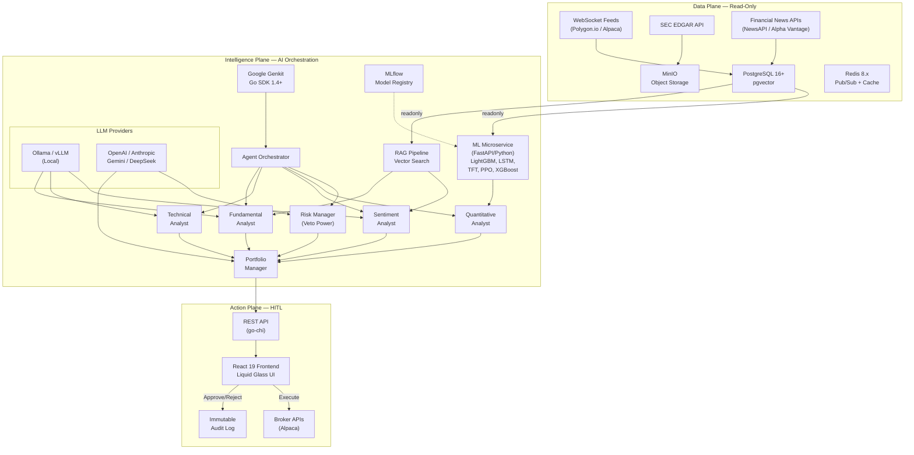

### The Three Planes

| Plane | Purpose | DB Role | Key Constraint |
|:------|:--------|:--------|:---------------|
| **Data Plane** | Ingest, store, and serve market data, filings, and news | `omnitrade_readonly` | AI agents have **SELECT-only** access |
| **Intelligence Plane** | Multi-agent analysis, debate, and trade signal generation | `omnitrade_readonly` | Agents **cannot execute trades** |
| **Action Plane** | Human review, trade approval, execution, and audit | `omnitrade_executor` | Every trade requires **human approval** |

---

## 2.1 Architectural Invariant: Zero Hardcoding

> [!CAUTION]
> **STRICT RULE — No hardcoded LLM models, providers, API keys, prompts, temperatures, or agent configurations anywhere in the codebase.** All values are stored in the database and fetched at runtime.

This is a foundational design principle that applies to **every layer** of the platform:

| What | ❌ Never Do | ✅ Always Do |
|:-----|:-----------|:------------|
| **LLM Provider** | `provider := "openai"` in code | Fetch from `llm_providers` table at runtime |
| **LLM Model** | `model := "gpt-5-mini"` in code | Fetch from `agent_model_config` table per agent role |
| **API Keys** | `OPENAI_API_KEY` in `.env` only | Store encrypted in `llm_providers.encrypted_api_key` (env vars for initial bootstrap only) |
| **System Prompt** | Prompt string literals in agent code | Fetch from `agent_model_config.system_prompt` field |
| **Temperature** | `temperature: 0.7` in code | Fetch from `agent_model_config.temperature` |
| **Max Tokens** | `max_tokens: 4096` in code | Fetch from `agent_model_config.max_tokens` |
| **Agent Skills** | Hardcoded tool lists | Fetch from `agent_skills` table (dynamic tool assignment) |
| **Context Window** | Fixed values in code | Read from `llm_models.context_window` at runtime |

### Agent Management UI

A dedicated **Agent Management** view in the frontend allows users to:

1. **Add/Remove LLM Providers** — Register new providers with API keys (encrypted at rest)
2. **Browse & Assign Models** — Assign any registered model to any agent role
3. **Edit Agent Prompts** — Customize system prompts per agent with a live editor
4. **Tune Parameters** — Adjust temperature, max tokens, top-p, frequency penalty per agent
5. **Manage Skills/Tools** — Enable or disable specific tools for each agent
6. **Test Configuration** — Send test prompts to verify agent behavior before going live
7. **A/B Compare** — Run two model configurations side-by-side for the same agent
8. **Import/Export** — Export agent configurations as YAML for version control

### Database Schema for Dynamic Configuration

```sql
-- All LLM providers and their API keys (encrypted at rest)
-- No API keys in .env files or source code after initial bootstrap
CREATE TABLE llm_providers (
    id UUID PRIMARY KEY DEFAULT gen_random_uuid(),
    name VARCHAR(50) NOT NULL UNIQUE,         -- e.g., 'openai', 'anthropic', 'ollama'
    display_name VARCHAR(100),
    provider_type VARCHAR(30),                 -- 'cloud', 'local', 'aggregator'
    base_url VARCHAR(255),                     -- endpoint URL
    encrypted_api_key BYTEA,                   -- AES-256-GCM encrypted
    is_active BOOLEAN DEFAULT true,
    created_at TIMESTAMPTZ DEFAULT NOW(),
    updated_at TIMESTAMPTZ DEFAULT NOW()
);

-- All available models per provider (dynamically fetched + cached)
CREATE TABLE llm_models (
    id UUID PRIMARY KEY DEFAULT gen_random_uuid(),
    provider_id UUID REFERENCES llm_providers(id),
    model_id VARCHAR(100) NOT NULL,           -- e.g., 'gpt-5-mini'
    display_name VARCHAR(100),
    context_window INTEGER,
    supports_streaming BOOLEAN DEFAULT true,
    supports_vision BOOLEAN DEFAULT false,
    supports_tools BOOLEAN DEFAULT true,
    input_cost_per_1k DECIMAL(10, 6),
    output_cost_per_1k DECIMAL(10, 6),
    is_active BOOLEAN DEFAULT true,
    UNIQUE(provider_id, model_id)
);

-- Per-user, per-agent configuration (the heart of dynamic config)
CREATE TABLE agent_model_config (
    id UUID PRIMARY KEY DEFAULT gen_random_uuid(),
    user_id UUID,                              -- NULL = system default
    agent_role VARCHAR(50) NOT NULL,           -- e.g., 'fundamental_analyst'
    model_id UUID REFERENCES llm_models(id),
    temperature DECIMAL(3, 2) DEFAULT 0.7,
    max_tokens INTEGER DEFAULT 4096,
    top_p DECIMAL(3, 2) DEFAULT 1.0,
    frequency_penalty DECIMAL(3, 2) DEFAULT 0.0,
    system_prompt TEXT,                        -- full system prompt (NO hardcoded prompts)
    is_active BOOLEAN DEFAULT true,
    created_at TIMESTAMPTZ DEFAULT NOW(),
    updated_at TIMESTAMPTZ DEFAULT NOW(),
    UNIQUE(user_id, agent_role)
);

-- Dynamic skill/tool assignment per agent
CREATE TABLE agent_skills (
    id UUID PRIMARY KEY DEFAULT gen_random_uuid(),
    agent_role VARCHAR(50) NOT NULL,
    skill_name VARCHAR(100) NOT NULL,          -- e.g., 'SearchFundamentalVectorDB'
    is_enabled BOOLEAN DEFAULT true,
    config JSONB,                              -- skill-specific parameters
    UNIQUE(agent_role, skill_name)
);
```

### Runtime Config Flow

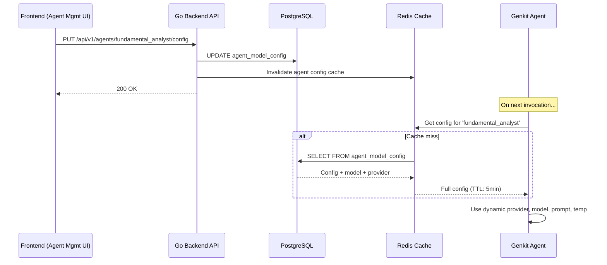

> [!IMPORTANT]
> **Environment variables** (`.env`) are used **only for initial bootstrapping** (database URL, Redis URL, encryption master key). All LLM-related configuration is stored in the database after first setup. The application reads `DATABASE_URL` from env, connects, and fetches everything else from PostgreSQL.

---

## 3. Infrastructure Architecture

### 3.1 Container Topology

All services are orchestrated via **Docker Compose**. The architecture is designed for local-first development with production-ready containerization.

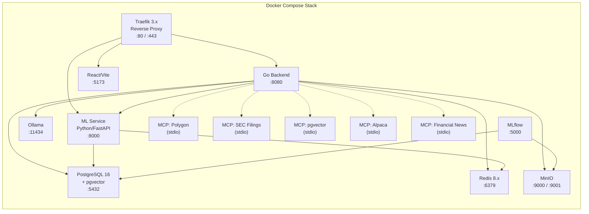

### 3.2 Docker Compose Services

```yaml
services:
  # ── Reverse Proxy ──────────────────────────────
  traefik:
    image: traefik:v3.3
    command:
      - "--api.insecure=true"
      - "--providers.docker=true"
      - "--entrypoints.web.address=:80"
      - "--entrypoints.websecure.address=:443"
    ports:
      - "80:80"
      - "443:443"
      - "8090:8080"          # Traefik dashboard
    volumes:
      - /var/run/docker.sock:/var/run/docker.sock:ro

  # ── Database ───────────────────────────────────
  db:
    image: pgvector/pgvector:pg16     # open-source pgvector image
    environment:
      POSTGRES_DB: omnitrade
      POSTGRES_USER: omnitrade
      POSTGRES_PASSWORD: ${DB_PASSWORD}
    ports:
      - "5432:5432"
    volumes:
      - pgdata:/var/lib/postgresql/data
    healthcheck:
      test: ["CMD-SHELL", "pg_isready -U omnitrade"]

  # ── Object Storage ────────────────────────────
  storage:
    image: minio/minio
    command: server /data --console-address ":9001"
    ports:
      - "9000:9000"
      - "9001:9001"
    volumes:
      - miniodata:/data

  # ── Cache & Pub/Sub ────────────────────────────
  redis:
    image: redis:8-alpine
    ports:
      - "6379:6379"
    volumes:
      - redisdata:/data

  # ── Local AI Inference ─────────────────────────
  ollama:
    image: ollama/ollama
    ports:
      - "11434:11434"
    volumes:
      - ollama_models:/root/.ollama
    # GPU acceleration (uncomment for NVIDIA)
    # deploy:
    #   resources:
    #     reservations:
    #       devices:
    #         - driver: nvidia
    #           count: 1
    #           capabilities: [gpu]

  # ── Go Backend ─────────────────────────────────
  backend:
    build: ./backend
    depends_on:
      db: { condition: service_healthy }
    environment:
      DATABASE_URL: "postgres://omnitrade:${DB_PASSWORD}@db:5432/omnitrade"
      OLLAMA_HOST: "http://ollama:11434"
      MINIO_ENDPOINT: "storage:9000"
      REDIS_URL: "redis://redis:6379"
      PORT: "8080"
    labels:
      - "traefik.http.routers.backend.rule=PathPrefix(`/api`)"

  # ── React Frontend ─────────────────────────────
  frontend:
    build: ./frontend
    labels:
      - "traefik.http.routers.frontend.rule=PathPrefix(`/`)"

  # ── ML Microservice (Python) ────────────────────
  ml-service:
    build: ./ml-service
    depends_on:
      db: { condition: service_healthy }
    environment:
      DATABASE_URL: "postgres://omnitrade:${DB_PASSWORD}@db:5432/omnitrade"
      REDIS_URL: "redis://redis:6379"
      MLFLOW_TRACKING_URI: "http://mlflow:5000"
      MODEL_STORE_PATH: "/models"
    ports:
      - "8000:8000"
    volumes:
      - ml_models:/models
    labels:
      - "traefik.http.routers.ml.rule=PathPrefix(`/ml`)"

  # ── MLflow Experiment Tracker ───────────────────
  mlflow:
    image: ghcr.io/mlflow/mlflow:v2.20.0
    command: mlflow server --host 0.0.0.0 --port 5000 --backend-store-uri postgresql://omnitrade:${DB_PASSWORD}@db:5432/mlflow --default-artifact-root /mlflow-artifacts
    depends_on:
      db: { condition: service_healthy }
    ports:
      - "5000:5000"
    volumes:
      - mlflow_artifacts:/mlflow-artifacts

volumes:
  pgdata:
  miniodata:
  redisdata:
  ollama_models:
  ml_models:
  mlflow_artifacts:
```

---

## 4. Backend Service (Go)

> The Go backend orchestrates LLM agents and delegates to the Python ML service for quantitative signals. See [Section 5](#5-ml-microservice-pythonfastapi) for the ML layer.

The backend is a monolithic Go service that bundles API serving, AI orchestration, and data ingestion into a single process.

### 4.1 Technology Stack

| Component | Technology | Version | License |
|:----------|:-----------|:--------|:--------|
| Language | Go | 1.26+ | BSD-3 |
| HTTP Router | go-chi | v5.x | MIT |
| Database Driver | sqlx | latest | MIT |
| AI Orchestration | Google Genkit Go SDK | 1.4+ | Apache 2.0 |

### 4.2 Internal Package Structure

```
backend/
├── main.go                          # Entry point — wires all dependencies
├── go.mod / go.sum                  # Go module definition
└── internal/
    ├── api/                         # HTTP layer
    │   ├── router.go                # go-chi route definitions + middleware
    │   └── handlers.go              # Request handlers (health, assets, proposals)
    ├── database/                    # Data access layer
    │   ├── db.go                    # PostgreSQL connection pool (sqlx)
    │   └── schema.sql               # DDL: stock_assets, market_data, trade_proposals, audit_logs
    ├── agent/                       # Intelligence Plane
    │   ├── orchestrator.go          # Genkit flow: GenerateTradeProposal
    │   ├── constants.go             # Agent roles, thresholds, configs
    │   ├── types.go                 # Typed I/O structs for all agents
    │   ├── errors.go                # Error types and handling
    │   ├── tools/                   # Genkit tools
    │   │   ├── definition.go        # Tool schema definitions
    │   │   ├── executor.go          # Tool execution logic
    │   │   ├── permissions.go       # Tool permission model
    │   │   ├── registry.go          # Tool registry & discovery
    │   │   └── categories/          # Tool categories (market, analysis, etc.)
    │   └── plugins/                 # Plugin system
    │       ├── plugin.go            # Plugin interface
    │       ├── manager.go           # Plugin lifecycle management
    │       ├── loader.go            # Dynamic plugin loading
    │       ├── registry.go          # Plugin registry
    │       └── circuit.go           # Circuit breaker for plugin failures
    └── ingestion/                   # Data Plane
        └── ticker.go                # Real-time tick engine (WebSocket → DB)
```

### 4.3 API Endpoints

| Method | Endpoint | Plane | Description |
|:-------|:---------|:------|:------------|
| `GET` | `/health` | — | Service health check |
| `GET` | `/api/v1/assets` | Data | List tracked stock assets |
| `GET` | `/api/v1/proposals` | Action | List pending trade proposals |
| `GET` | `/api/v1/proposals/{id}` | Action | Get specific proposal with CoT reasoning |
| `POST` | `/api/v1/proposals/{id}/approve` | Action | Approve and execute a trade (requires 2FA) |
| `POST` | `/api/v1/proposals/{id}/reject` | Action | Reject with feedback |
| `GET` | `/api/v1/agents` | Intelligence | List all agent roles |
| `GET` | `/api/v1/agents/{role}/config` | Intelligence | Get agent config (model, prompt, temp, skills) |
| `PUT` | `/api/v1/agents/{role}/config` | Intelligence | Update agent config (hot-swap, no restart) |
| `GET` | `/api/v1/agents/{role}/skills` | Intelligence | List agent skills with enabled/disabled state |
| `PUT` | `/api/v1/agents/{role}/skills` | Intelligence | Enable/disable skills for agent |
| `POST` | `/api/v1/agents/{role}/test` | Intelligence | Test agent config with a sample prompt |
| `GET` | `/api/v1/providers` | Intelligence | List all LLM providers |
| `POST` | `/api/v1/providers` | Intelligence | Register new LLM provider (API key encrypted) |
| `PUT` | `/api/v1/providers/{id}` | Intelligence | Update provider config or key |
| `DELETE` | `/api/v1/providers/{id}` | Intelligence | Remove provider |
| `GET` | `/api/v1/providers/{id}/models` | Intelligence | List models for a provider |
| `POST` | `/api/v1/providers/{id}/test` | Intelligence | Test provider connectivity |

### 4.4 Middleware Stack

```
Request → Logger → Recoverer → RequestID → RealIP → CORS → JWT Auth → Handler
```

---

## 5. ML Microservice (Python/FastAPI)

A dedicated Python microservice provides **quantitative ML predictions** consumed by the Go backend's Quantitative Analyst agent.

> 📄 **Full specification:** [09_Machine_Learning_Models.md](./09_Machine_Learning_Models.md)

### 5.1 Technology Stack

| Component | Technology | License |
|:----------|:-----------|:--------|
| Language | Python 3.12+ | PSF |
| API Framework | FastAPI | MIT |
| ML (Tabular) | LightGBM, XGBoost | MIT, Apache 2.0 |
| ML (Deep Learning) | PyTorch, pytorch-forecasting | BSD, MIT |
| ML (RL) | Stable-Baselines3, Gymnasium | MIT |
| Quant Pipeline | Qlib (Microsoft) | MIT |
| Technical Indicators | TA-Lib, pandas-ta | BSD, MIT |
| Experiment Tracking | MLflow | Apache 2.0 |
| Data Versioning | DVC | Apache 2.0 |
| Backtesting | Vectorbt, Quantstats | Apache 2.0, MIT |
| Model Optimization | ONNX Runtime | MIT |

### 5.2 Model Zoo

| Model | Type | Purpose | Retraining Schedule |
|:------|:-----|:--------|:-------------------|
| **LightGBM** | Supervised (Regression) | Factor ranking for mid-term value investing | Weekly |
| **XGBoost** | Supervised (Classification) | Momentum scoring for event-driven strategies | Daily |
| **LSTM** | Deep Learning (Bi-LSTM + Attention) | 5-day price return forecasting | Monthly |
| **Temporal Fusion Transformer** | Deep Learning | Multi-horizon quantile forecasts (1d/5d/20d) | Monthly |
| **1D-CNN** | Deep Learning | Chart pattern detection (12 patterns) | Quarterly |
| **Neural GARCH** | Hybrid (Classical + DL) | Volatility forecasting for position sizing | Weekly |
| **PPO** | Reinforcement Learning | Intraday execution policy (commodities) | Monthly |
| **SAC** | Reinforcement Learning | Portfolio allocation optimization | Monthly |
| **Meta-Learner** | Ensemble (Logistic Regression) | Weighted signal aggregation (ML + LLM) | Weekly |

### 5.3 API Endpoints

| Method | Endpoint | Description |
|:-------|:---------|:------------|
| `POST` | `/ml/predict` | Generate ML predictions for a symbol |
| `POST` | `/ml/predict/batch` | Batch predictions for portfolio screening |
| `GET` | `/ml/models` | List deployed models with versions and metrics |
| `GET` | `/ml/models/{name}/importance` | Feature importance for a model |
| `POST` | `/ml/backtest` | Run backtest with specified parameters |
| `GET` | `/ml/health` | ML service health check |

### 5.4 Integration Flow

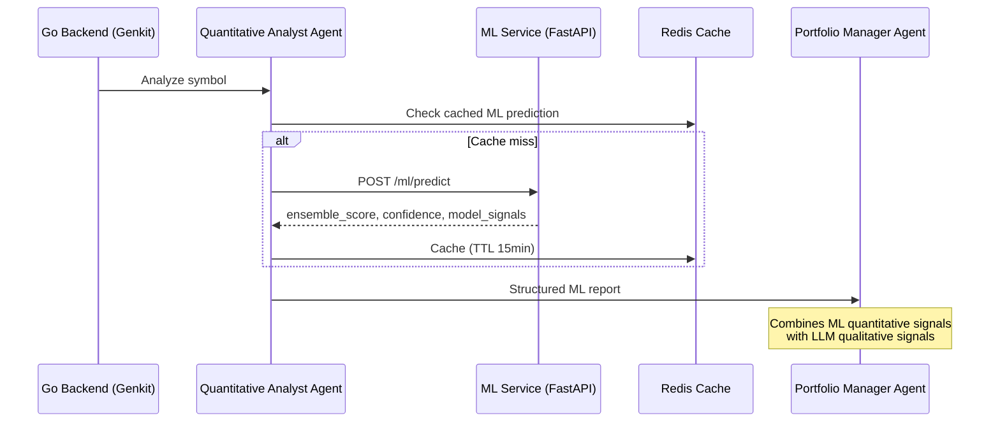

---

## 6. MCP Server Layer (TypeScript/Node.js)

OmniTrade uses five **Model Context Protocol (MCP)** servers that provide specialized data access tools to AI agents. All MCP servers use the `@modelcontextprotocol/sdk` and communicate over **stdio** transport.

### 5.1 MCP Server Inventory

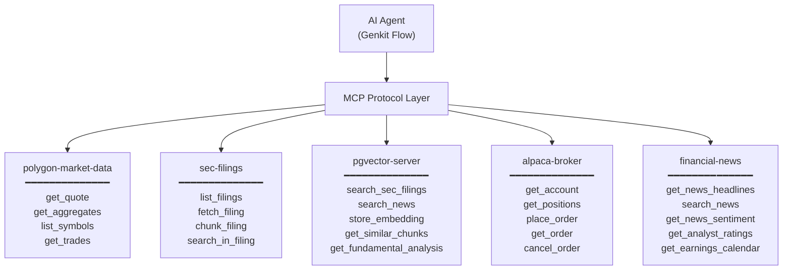

### 5.2 Server Details

| MCP Server | Tech/SDK | External APIs | Purpose | Key Env Vars |
|:-----------|:---------|:-------------|:--------|:-------------|
| **polygon-market-data** | TypeScript, `@modelcontextprotocol/sdk` | Polygon.io REST v3 | Real-time quotes, OHLCV aggregates, symbol lookup | `POLYGON_API_KEY` |
| **sec-filings** | TypeScript, Axios | SEC EDGAR | CIK lookup, filing lists, full-text fetch, semantic chunking | `SEC_API_KEY`, `USER_AGENT` |
| **pgvector-server** | TypeScript, `pg` (node-postgres) | PostgreSQL + pgvector | Semantic search over filings and news, vector similarity | `DATABASE_URL`, `PGVECTOR_*` |
| **alpaca-broker** | TypeScript, Axios | Alpaca Trading API | Account info, positions, order placement/cancellation | `ALPACA_API_KEY`, `ALPACA_SECRET_KEY` |
| **financial-news** | TypeScript, Axios, Cheerio | NewsAPI.org, Alpha Vantage, Yahoo Finance | Headlines, sentiment analysis, analyst ratings, earnings | `NEWS_API_KEY`, `ALPHA_VANTAGE_API_KEY` |

### 5.3 MCP Configuration (`.mcp.json`)

```json
{
  "mcpServers": {
    "polygon-market-data": {
      "command": "node",
      "args": ["mcp/polygon-market-data/dist/index.js"],
      "env": { "POLYGON_API_KEY": "${POLYGON_API_KEY}" }
    },
    "sec-filings": {
      "command": "node",
      "args": ["mcp/sec-filings/dist/index.js"],
      "env": { "SEC_API_KEY": "${SEC_API_KEY}" }
    },
    "pgvector-server": {
      "command": "node",
      "args": ["mcp/pgvector-server/dist/index.js"],
      "env": { "DATABASE_URL": "${DATABASE_URL}" }
    },
    "alpaca-broker": {
      "command": "node",
      "args": ["mcp/alpaca-broker/dist/index.js"],
      "env": { "ALPACA_API_KEY": "${ALPACA_API_KEY}" }
    },
    "financial-news": {
      "command": "node",
      "args": ["mcp/financial-news/dist/index.js"],
      "env": { "NEWS_API_KEY": "${NEWS_API_KEY}" }
    }
  }
}
```

---

## 6. Frontend Application (React/Vite)

### 6.1 Technology Stack

| Component | Technology | Version | License |
|:----------|:-----------|:--------|:--------|
| Framework | React | 19.x | MIT |
| Build Tool | Vite | 7.x | MIT |
| Language | TypeScript | 5.7.x | Apache 2.0 |
| Styling | Vanilla CSS (Liquid Glass) | — | — |
| State Management | Zustand | 5.x | MIT |
| Generative UI | CopilotKit | latest | MIT |
| Charts | TradingView Lightweight Charts / Recharts | latest | Apache 2.0 |

### 6.2 Key Views

| View | Purpose |
|:-----|:--------|
| **Dashboard** | Portfolio P&L, live prices, active agent models |
| **Signal Review (HITL Inbox)** | Queue of PENDING trade proposals with Chain-of-Thought, source citations, and Approve/Reject buttons |
| **Agent Management** | Configure agent models, prompts, temperatures, skills, A/B compare (see [§2.1](#21-architectural-invariant-zero-hardcoding)) |
| **LLM Provider Management** | Add/remove providers, API keys (encrypted), enable/disable models |
| **Natural Language Command Bar** | `Cmd+K` spotlight for agent queries, chart rendering, portfolio queries |
| **Customizable Command Center** | Draggable, resizable widget panels |
| **ML Model Dashboard** | Backtest results, model performance, feature importance charts |

### 6.3 Design System — "Liquid Glass"

- **Aesthetic**: Glassmorphism with physics-based refraction and dynamic specularity
- **Typography**: Google Fonts (Inter, Outfit) — no browser defaults
- **Theming**: Dark "Pro Terminal" mode + light "Liquid" consumer mode
- **Micro-animations**: Hover effects, smooth transitions, dynamic background gradients tied to portfolio P&L
- **i18n**: Full support for English (LTR) and Arabic (RTL)

---

## 7. Database Architecture

### 7.1 PostgreSQL + pgvector

| Component | Technology | Version | License |
|:----------|:-----------|:--------|:--------|
| RDBMS | PostgreSQL | 16+ | PostgreSQL License (OSS) |
| Vector Extension | pgvector | 0.5+ | PostgreSQL License (OSS) |
| Docker Image | `pgvector/pgvector:pg16` | — | — |

### 7.2 Schema Overview

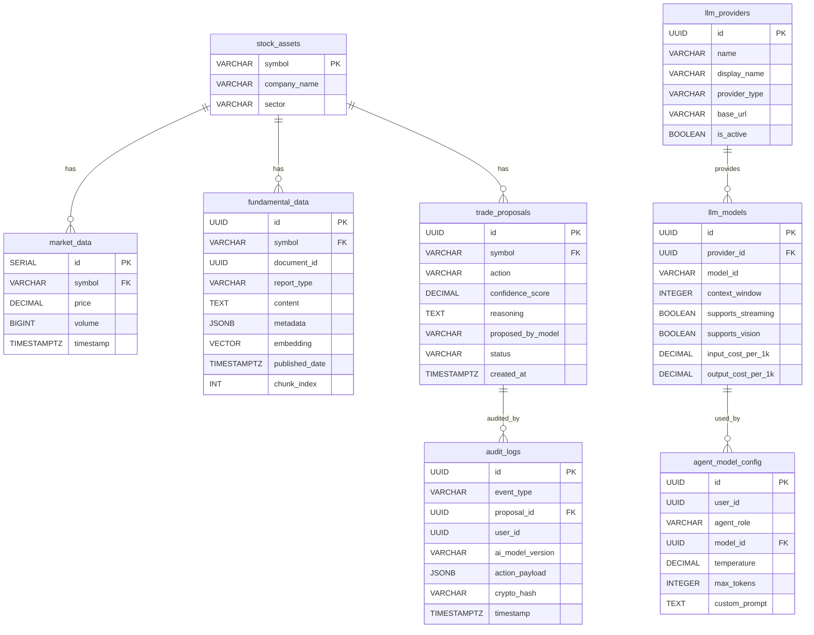

### 7.3 Database Roles (RBAC)

| Role | Permissions | Used By |
|:-----|:-----------|:--------|
| `omnitrade_readonly` | `SELECT` on `market_data`, `fundamental_data`, `stock_assets` | Intelligence Plane (Genkit flows) |
| `omnitrade_executor` | `INSERT/UPDATE` on `trade_proposals`, `audit_logs`, `portfolios` | Action Plane API handlers |
| DBA / Admin | Full DDL/DML | Schema migrations only |

### 7.4 Indexing Strategy

```sql
-- HNSW vector index for fast cosine similarity search
CREATE INDEX idx_fundamental_embedding
  ON fundamental_data USING hnsw (embedding vector_cosine_ops);

-- Metadata pre-filters (critical for avoiding cross-symbol hallucinations)
CREATE INDEX idx_fundamental_symbol ON fundamental_data(symbol);
CREATE INDEX idx_fundamental_date ON fundamental_data(published_date DESC);

-- Trigram index for hybrid keyword search
CREATE INDEX idx_fundamental_content_trgm
  ON fundamental_data USING gin (content gin_trgm_ops);
```

---

## 8. RAG Pipeline & Vector Search

### 8.1 Ingestion Pipeline

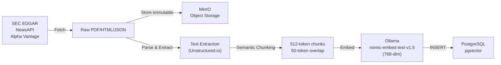

| Step | Details |
|:-----|:--------|
| **Fetch** | SEC EDGAR API (nightly), NewsAPI/Alpha Vantage (hourly) |
| **Store Raw** | MinIO: `filings/{SYMBOL}/{YEAR}/{TYPE}/{UUID}.pdf` |
| **Parse** | Unstructured.io extracts text, tables, financial structures |
| **Chunk** | Semantic splitting: 512 tokens, 50-token overlap, header-aware |
| **Embed** | `nomic-embed-text-v1.5` via Ollama (768-dim), alt: `BAAI/bge-m3` (1024-dim) |
| **Store Vectors** | PostgreSQL `fundamental_data` table with pgvector HNSW index |

### 8.2 Retrieval Pipeline

```mermaid
flowchart LR
    Q["Agent Query:<br/>'Analyze TSLA Q3'"] -->|"1. Query Rewrite"| R["LLM rewrites for<br/>better retrieval"]
    R -->|"2. Metadata Filter"| F["WHERE symbol='TSLA'<br/>AND date > 30d ago"]
    F -->|"3. Hybrid Search"| H["Dense: pgvector cosine<br/>Sparse: pg_trgm keyword"]
    H -->|"4. RRF Fusion"| RRF["Reciprocal Rank<br/>Fusion (top 20)"]
    RRF -->|"5. Rerank"| RE["Cross-Encoder<br/>bge-reranker-v2-m3<br/>(top 5)"]
    RE -->|"6. Generate"| GEN["LLM Summarizer<br/>(Llama 3 / DeepSeek)"]
```

### 8.3 RAG Strategies

| Strategy | Purpose |
|:---------|:--------|
| **Metadata-Filtered RAG** | Pre-filter by `symbol` + `date_range` before vector search — prevents cross-ticker hallucinations |
| **Hybrid Search** | Dense (pgvector cosine) + Sparse (pg_trgm trigram) combined via Reciprocal Rank Fusion |
| **Parent-Document Retrieval** | Search small chunks (256 tokens) for accuracy, return parent chunks (1024 tokens) for context |
| **Cross-Encoder Reranking** | `BAAI/bge-reranker-v2-m3` reranks top-20 → top-5 most relevant chunks |

---

## 9. AI Agent System & Debate Topology

### 9.1 Agent Hierarchy

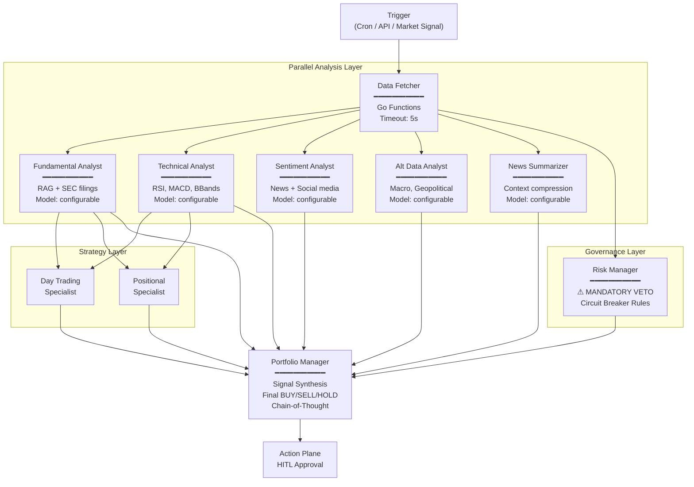

### 9.2 Agent Specifications

| Agent ID | Role | Default Model | Timeout | Required | Key Tools |
|:---------|:-----|:-------------|:--------|:---------|:----------|
| `data_fetcher` | Data retrieval | Go Functions (no LLM) | 5s | ✅ | `GetMarketDataHist`, `ComputeIndicators` |
| `fundamental_analyst` | SEC filing analysis | `gpt-5-mini` | 30s | ✅ | `SearchFundamentalVectorDB` (pgvector MCP) |
| `technical_analyst` | Price pattern detection | `gemini-3-flash` | 10s | ✅ | `GetMarketDataHist`, `ComputeIndicators` |
| `sentiment_analyst` | Market mood gauging | `llama3.2:3b` (local) | 15s | ❌ | `SearchNewsVectorDB`, `GetSocialSentiment` |
| `news_summarizer` | Context compression | `llama3.2:1b` (local) | 10s | ❌ | `SearchNewsVectorDB` |
| `alt_data_analyst` | Macro & geopolitical | `claude-sonnet-4-6` | 20s | ❌ | `GetAlternativeData` |
| **`quantitative_analyst`** | **ML model signals** | **ML Service (FastAPI)** | **10s** | **✅** | **`GetMLPrediction` → LightGBM, LSTM, TFT, PPO** |
| `risk_manager` | Capital preservation | `claude-sonnet-4-6` | 20s | ✅ | Hard-coded circuit breakers + **GARCH volatility** |
| `portfolio_manager` | Decision synthesis | `claude-opus-4-6` | 60s | ✅ | All agent outputs + **ML meta-learner** |
| `day_trading_specialist` | Intraday optimization | `gemini-3-flash` | 15s | ❌ | — |
| `positional_specialist` | Long-term optimization | `gpt-5-mini` | 30s | ❌ | — |

### 9.3 Risk Manager Circuit Breakers

| Rule | Condition | Action |
|:-----|:----------|:-------|
| Single position limit | Position > 10% portfolio | **REJECT** |
| Sector exposure | Sector > 25% portfolio | **REDUCE_SIZE** |
| VIX threshold (medium) | VIX > 30 | 50% size reduction |
| VIX threshold (extreme) | VIX > 40 | **HOLD ONLY** — no buying |
| Max daily loss | Daily P&L < -5% | **HALT** all proposals |

### 9.4 Trade Proposal Output Schema

```json
{
  "symbol": "AAPL",
  "action": "BUY",
  "confidence_score": 0.88,
  "recommended_position_size": 0.05,
  "target_price": 245.50,
  "stop_loss_price": 220.00,
  "time_horizon": "MID_TERM",
  "chain_of_thought": "Fundamental analyst reports strong Q3 earnings...",
  "weighted_signal_breakdown": {
    "fundamental": 0.35,
    "technical": 0.25,
    "sentiment": 0.20,
    "risk": 0.20
  }
}
```

---

## 10. Universal LLM Provider Abstraction

### 10.1 Provider Categories

| Category | Providers | Protocol |
|:---------|:----------|:---------|
| **US Cloud** | OpenAI, Anthropic, Google Gemini, xAI Grok | HTTPS API |
| **China/Asia Cloud** | DeepSeek, Zhipu, Moonshot, ByteDance, Alibaba, Baidu, Tencent, Minimax, SiliconFlow, Z.ai | HTTPS API |
| **Aggregators** | OpenRouter, Together AI, Groq, Fireworks AI | HTTPS API |
| **Local/Private** | Ollama, LM Studio, vLLM, Custom Endpoints | HTTP (localhost) |

### 10.2 Architecture

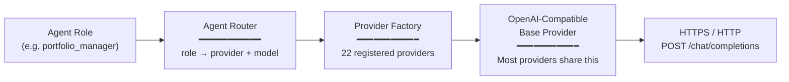

### 10.3 Key Design Decisions

- **Factory Pattern**: `ProviderFactory` with 22 registered constructors — any new provider is a one-line registration
- **OpenAI-Compatible Base**: Most providers (Ollama, DeepSeek, Groq, Together, etc.) share the OpenAI chat/completions API format — a single base implementation covers ~18 of 22 providers
- **Per-Agent Configuration**: Stored in `agent_model_config` table — users assign any model to any agent role via UI or YAML
- **Hot-Swappable**: Model assignments can be changed at runtime without restart via `PUT /agents/config`
- **Fallback Cascades**: Auto-routing if primary provider fails (e.g., Claude API 500 → GPT-5 → local DeepSeek)

### 10.4 Default Routing Configuration

| Agent | Provider | Model | Rationale |
|:------|:---------|:------|:----------|
| `data_fetcher` | Ollama (local) | `llama3.2:3b` | No LLM needed; fast local fallback |
| `fundamental_analyst` | OpenAI | `gpt-5-mini` | Strong reasoning at low cost |
| `technical_analyst` | DeepSeek | `deepseek-chat` | Excellent at numerical analysis |
| `sentiment_analyst` | Ollama (local) | `llama3.2:3b` | Fast, zero-cost sentiment extraction |
| `news_summarizer` | Ollama (local) | `llama3.2:1b` | Ultra-fast context compression |
| `risk_manager` | Anthropic | `claude-sonnet-4-6` | Safety-conscious reasoning |
| `portfolio_manager` | Anthropic | `claude-opus-4-6` | Best-in-class synthesis |
| `quantitative_analyst` | Google | `gemini-3-flash` | Fast quantitative processing |

---

## 11. Data Flow Diagrams

### 11.1 Real-Time Market Data Flow (Tick Engine)

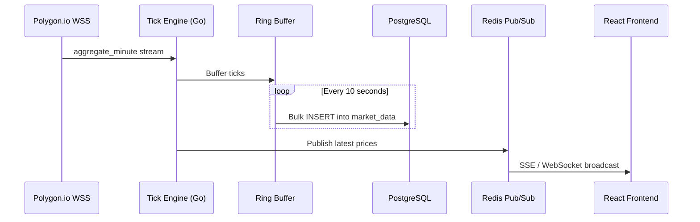

### 11.2 Trade Proposal Lifecycle

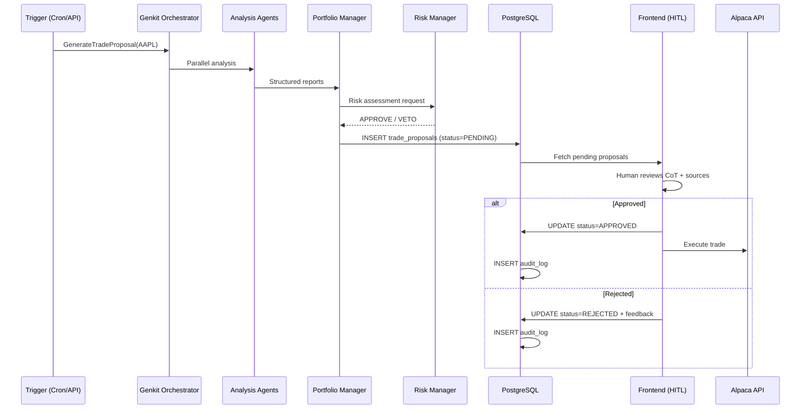

### 11.3 Document Ingestion & RAG Flow

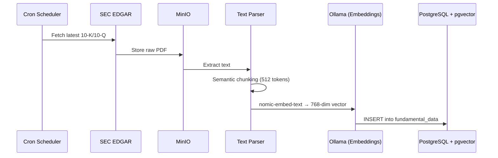

---

## 12. Security Architecture

### 12.1 Defense-in-Depth Layers

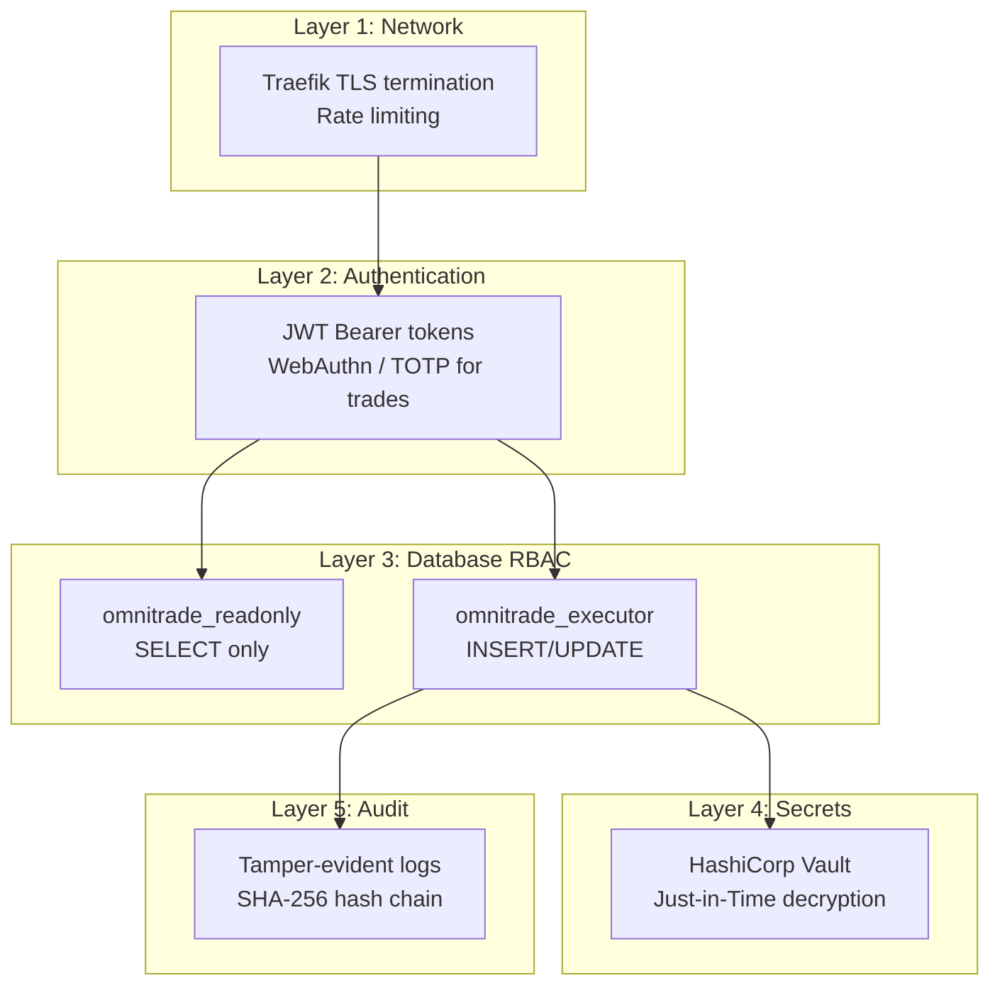

### 12.2 Key Security Principles

| Principle | Implementation |
|:----------|:-------------|
| **AI cannot execute trades** | Intelligence Plane has `SELECT`-only DB role |
| **SQL injection prevention** | Read-only role rejects all `INSERT/UPDATE/DELETE` even if injected |
| **Secret isolation** | Brokerage keys in HashiCorp Vault; decrypted only at trade execution time |
| **Immutable audit trail** | SHA-256 hash chain (`crypto_hash` = SHA-256 of previous log + current payload) |
| **2FA for trades** | WebAuthn or TOTP required to approve any trade |
| **LLM API key encryption** | Provider API keys encrypted at rest in `llm_providers` table |

---

## 13. Networking & Reverse Proxy (Traefik)

### 13.1 Traefik Configuration

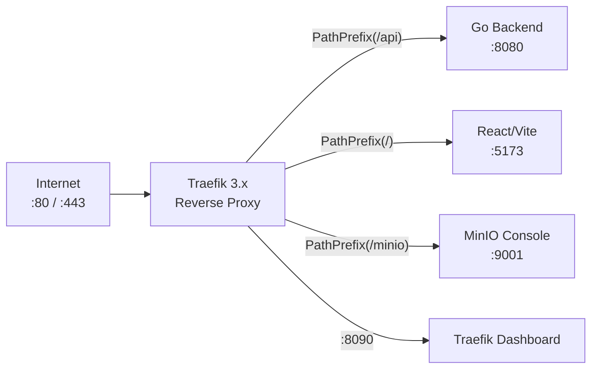

### 13.2 Routing Rules

| Path Pattern | Target Service | Notes |
|:-------------|:--------------|:------|
| `/api/*` | Go Backend (:8080) | REST API endpoints |
| `/genkit/*` | Go Backend (:8080) | Genkit flow development UI |
| `/` | React Frontend (:5173) | SPA catch-all |
| `/minio/*` | MinIO Console (:9001) | Object storage admin (restricted) |

### 13.3 Traefik Features Used

- **Automatic TLS** via Let's Encrypt (production)
- **Docker provider** — auto-discovers services via labels
- **Rate limiting** middleware per route
- **Circuit breaker** middleware for backend health
- **CORS** headers injected via middleware chain

---

## 14. Observability & Monitoring

### 14.1 Monitoring Stack (All Open-Source)

| Component | Technology | Purpose | License |
|:----------|:-----------|:--------|:--------|
| Metrics | **Prometheus** | Time-series metrics collection | Apache 2.0 |
| Visualization | **Grafana** | Dashboards and alerting | AGPL 3.0 |
| Log Aggregation | **Loki** | Centralized log collection | AGPL 3.0 |
| Tracing | **Jaeger** | Distributed tracing for Genkit flows | Apache 2.0 |
| Uptime | **Uptime Kuma** | Service health monitoring | MIT |

### 14.2 Key Metrics

| Metric | Source | Alert Threshold |
|:-------|:-------|:---------------|
| Agent latency (p95) | Genkit flows | > 30s |
| LLM provider error rate | Agent Router | > 5% in 5min |
| Token cost per signal | Agent Router | > $0.50 per signal |
| Trade proposal queue depth | PostgreSQL | > 50 PENDING |
| Database connection pool | sqlx | > 80% utilization |
| WebSocket reconnections | Tick Engine | > 3/hour |
| RAG retrieval accuracy | pgvector | Monitored via reranker scores |

---

## 15. Open-Source Technology Matrix

### 16.1 Complete Stack

| Layer | Technology | Purpose | License | Version |
|:------|:-----------|:--------|:--------|:--------|
| **Language** | Go | Backend service | BSD-3 | 1.26+ |
| **Language** | TypeScript | MCP servers, Frontend | Apache 2.0 | 5.7+ |
| **Language** | Python | ML Microservice | PSF | 3.12+ |
| **Backend Framework** | go-chi | HTTP routing | MIT | 5.x |
| **ML API** | FastAPI | ML model serving | MIT | 0.115+ |
| **Database Access** | sqlx | PostgreSQL driver | MIT | latest |
| **AI Orchestration** | Google Genkit | Multi-agent flows | Apache 2.0 | 1.4+ |
| **Database** | PostgreSQL | Primary RDBMS | PostgreSQL License | 16+ |
| **Vector DB** | pgvector | Embedding search | PostgreSQL License | 0.5+ |
| **Object Storage** | MinIO | S3-compatible files | AGPL 3.0 | latest |
| **Cache / Pub-Sub** | Redis | Caching, real-time broadcast | BSD-3 | 8.x |
| **Local AI** | Ollama | Local LLM inference | MIT | latest |
| **Embedding Model** | nomic-embed-text-v1.5 | Text → 768-dim vectors | Apache 2.0 | 1.5 |
| **Reranker** | BAAI/bge-reranker-v2-m3 | Cross-encoder reranking | MIT | v2 |
| **LLM (local)** | Llama 3.2 (1B/3B) | Fast local inference | Meta Community | 3.2 |
| **LLM (local)** | DeepSeek-V3 | Complex local reasoning | MIT | V3 |
| **ML (Tabular)** | LightGBM | Factor ranking | MIT | 4.6+ |
| **ML (Tabular)** | XGBoost | Momentum scoring | Apache 2.0 | 2.1+ |
| **ML (Deep Learning)** | PyTorch | LSTM, TFT, CNN, Neural GARCH | BSD | 2.5+ |
| **ML (Time Series)** | pytorch-forecasting | Temporal Fusion Transformer | MIT | 1.2+ |
| **ML (RL)** | Stable-Baselines3 | PPO, SAC for execution/allocation | MIT | 2.4+ |
| **ML (RL Envs)** | Gymnasium | Custom trading environments | MIT | 1.0+ |
| **Quant Pipeline** | Qlib (Microsoft) | End-to-end quant research | MIT | 0.9+ |
| **Technical Indicators** | TA-Lib | 150+ technical indicators | BSD | 0.5+ |
| **Experiment Tracking** | MLflow | Model registry, metrics | Apache 2.0 | 2.20+ |
| **Data Versioning** | DVC | Dataset version control | Apache 2.0 | 3.60+ |
| **Backtesting** | Vectorbt | High-performance backtesting | Apache 2.0 | 0.27+ |
| **Analytics** | Quantstats | Performance tear sheets | MIT | latest |
| **Model Optimization** | ONNX Runtime | Accelerated inference | MIT | 1.20+ |
| **Frontend** | React | UI framework | MIT | 19.x |
| **Build Tool** | Vite | Frontend bundler | MIT | 7.x |
| **State Management** | Zustand | Client state | MIT | 5.x |
| **Generative UI** | CopilotKit | Dynamic AI-rendered components | MIT | latest |
| **Charts** | TradingView Lightweight Charts | Financial charting | Apache 2.0 | latest |
| **Charts** | Recharts | General charting | MIT | latest |
| **Reverse Proxy** | Traefik | Routing, TLS, load balancing | MIT | 3.x |
| **Containerization** | Docker + Docker Compose | Service orchestration | Apache 2.0 | latest |
| **Secrets** | HashiCorp Vault | Secret management | BUSL 1.1 / OSS | latest |
| **Document Parsing** | Unstructured.io | PDF/HTML text extraction | Apache 2.0 | latest |
| **Web Scraping** | Cheerio | HTML parsing (news) | MIT | latest |
| **HTTP Client** | Axios | HTTP requests (MCP servers) | MIT | latest |
| **Monitoring** | Prometheus + Grafana | Metrics + dashboards | Apache/AGPL | latest |
| **Logging** | Loki | Log aggregation | AGPL 3.0 | latest |
| **Tracing** | Jaeger | Distributed tracing | Apache 2.0 | latest |
| **MCP Protocol** | @modelcontextprotocol/sdk | Tool protocol for AI agents | MIT | latest |

### 15.2 External Data APIs

| API | Purpose | Free Tier Available |
|:----|:--------|:-------------------|
| Polygon.io | Real-time + historical market data | ✅ (delayed) |
| Alpaca | Broker API (paper trading) | ✅ |
| SEC EDGAR | SEC filings (10-K, 10-Q, 8-K) | ✅ (fully free) |
| NewsAPI.org | Financial news headlines | ✅ (100 req/day) |
| Alpha Vantage | News sentiment + fundamentals | ✅ (5 req/min) |
| Yahoo Finance | Analyst ratings, earnings calendar | ✅ (scraping) |

---

## 16. Deployment Topology

### 16.1 Local Development

```
┌────────────────────────────────────────────────────┐
│                  Developer Machine                  │
│                                                     │
│   docker-compose up -d                             │
│   ┌──────────┐  ┌──────────┐  ┌──────────┐       │
│   │PostgreSQL│  │  MinIO   │  │  Redis   │       │
│   │+pgvector │  │          │  │          │       │
│   └──────────┘  └──────────┘  └──────────┘       │
│   ┌──────────┐  ┌──────────┐                      │
│   │  Ollama  │  │ Traefik  │                      │
│   │ (GPU opt)│  │          │                      │
│   └──────────┘  └──────────┘                      │
│                                                     │
│   go run backend/main.go     (hot reload)          │
│   npm run dev                (Vite HMR)            │
│   node mcp/*/dist/index.js   (MCP stdio)           │
└────────────────────────────────────────────────────┘
```

### 16.2 Production (Hybrid Cloud)

```
┌─────────────────────────────────────────────┐
│           Cloud VPS / Kubernetes             │
│                                              │
│  ┌─────────┐     ┌─────────┐               │
│  │Traefik  │────▶│ Backend │               │
│  │ (TLS)   │     │  (Go)   │               │
│  └─────────┘     └─────────┘               │
│       │               │                     │
│  ┌─────────┐     ┌─────────┐               │
│  │Frontend │     │PostgreSQL│               │
│  │ (CDN)   │     │+pgvector │               │
│  └─────────┘     └─────────┘               │
│                       │                     │
│  ┌─────────┐     ┌─────────┐               │
│  │  MinIO  │     │  Redis  │               │
│  │ (Volumes)│    │ Cluster │               │
│  └─────────┘     └─────────┘               │
│                                              │
│  ┌─────────────────────────┐                │
│  │  Ollama (GPU Node)      │                │
│  │  OR vLLM (A100/H100)   │                │
│  └─────────────────────────┘                │
└─────────────────────────────────────────────┘
```

### 16.3 First-Run Warm-Up Script

```bash
#!/bin/bash
# Pull required open-source models
docker exec -it ollama ollama pull nomic-embed-text:v1.5    # Embeddings
docker exec -it ollama ollama pull llama3.2:1b               # News summarizer
docker exec -it ollama ollama pull llama3.2:3b               # Sentiment analysis
docker exec -it ollama ollama pull deepseek-coder:v3         # Complex reasoning
```

---

## 17. Environment Configuration

### 17.1 Core Environment Variables

| Variable | Example | Description |
|:---------|:--------|:------------|
| `DATABASE_URL` | `postgres://user:pass@db:5432/omnitrade` | PostgreSQL connection |
| `OLLAMA_HOST` | `http://ollama:11434` | Local AI inference endpoint |
| `MINIO_ENDPOINT` | `storage:9000` | Object storage endpoint |
| `REDIS_URL` | `redis://redis:6379` | Cache & pub/sub |
| `PORT` | `8080` | Backend API port |
| `SECRET_KEY` | `<random>` | JWT signing key |
| `TRADING_MODE` | `PAPER` / `LIVE` | Paper trading vs live brokerage |
| `AI_PROVIDER` | `OLLAMA` / `OPENROUTER` | Default AI provider |

### 17.2 External API Keys

| Variable | Provider | Required |
|:---------|:---------|:---------|
| `POLYGON_API_KEY` | Polygon.io market data | For real-time quotes |
| `ALPACA_API_KEY` + `ALPACA_SECRET_KEY` | Alpaca broker | For trade execution |
| `SEC_API_KEY` | SEC EDGAR | Optional (public API) |
| `NEWS_API_KEY` | NewsAPI.org | For news headlines |
| `ALPHA_VANTAGE_API_KEY` | Alpha Vantage | For news sentiment |
| `OPENAI_API_KEY` | OpenAI | If using cloud LLMs |
| `ANTHROPIC_API_KEY` | Anthropic | If using cloud LLMs |
| `GOOGLE_API_KEY` | Google Gemini | If using cloud LLMs |
| `GROK_API_KEY` | xAI Grok | If using cloud LLMs |
| `DEEPSEEK_API_KEY` | DeepSeek | If using cloud LLMs |

---

> **This document provides the complete architectural blueprint of OmniTrade.** Every component, data flow, security boundary, and technology choice is documented here. For ML model details, see [09_Machine_Learning_Models.md](./09_Machine_Learning_Models.md). For agent topology, see [02_Agent_Intelligence_System.md](./02_Agent_Intelligence_System.md). For design rationale, see `docs/AI_Trading_System_Architecture.md` and `docs/PRD_OmniTrade.md`.
