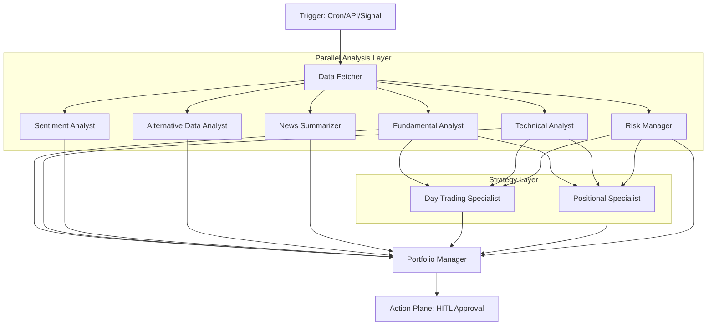

# OmniTrade: Agent Intelligence System Specification

This document defines the specialized AI agents, their orchestration patterns, and the "Debate Topology" within the OmniTrade Intelligence Plane.

---

## 1. The Debate Topology Architecture

OmniTrade utilizes a hierarchical multi-agent structure where specialized analyst agents gather and interpret data, passing structured findings to the Portfolio Manager for synthesis.

### 1.1 Interaction Diagram



### 1.2 Flow Execution Sequence

1.  **Trigger**: Cron job, API call, or real-time market event initiates `GenerateTradeProposal` flow for a ticker.
2.  **Data Gathering**: `Data Fetcher` retrieves market data (deterministic, no LLM needed).
3.  **Parallel Analysis**: Specialized agents analyze their domains (Fundamental, Technical, Sentiment, Alt Data, News) concurrently.
4.  **Strategy Optimization**: Strategy-specific agents (Day/Positional) refine signals for specific time horizons.
5.  **Governance**: `Risk Manager` evaluates exposure and macro conditions. It holds **MANDATORY VETO** power.
6.  **Synthesis**: `Portfolio Manager` receives all reports, resolves conflicts, and produces the final BUY/SELL/HOLD decision with Chain-of-Thought reasoning.
7.  **Human Review**: Final proposal is stored as `PENDING` for human approval.

---

## 2. Orchestration & Interoperability (Dify & A2A)

OmniTrade uses **Dify** as the visual orchestration engine and the **Google Agent-to-Agent (A2A) Protocol** for standardized inter-agent communication.

### 2.1 Dify Orchestration
- **Visual Flow Builder:** Complex agent workflows (like the Debate Topology) are designed and monitored visually in Dify.
- **Skill Management:** Tools (e.g., fetching market data, web search) are integrated into Dify as connectable nodes.
- **Agent Lifecycle:** Dify acts as the central control plane, orchestrating when and how each specialist agent is invoked.

### 2.2 Google A2A Protocol
- **Agent Cards:** Every analyst agent exposes its identity, required inputs, and outputs via an `AgentCard` following the A2A spec. This card acts as a discoverable REST endpoint.
- **Dynamic Discovery:** Dify and the Portfolio Manager use Agent Cards to discover available agents and their schemas dynamically, enabling zero-hardcoding agent integration.
- **LiteLLM Routing:** A2A requests are routed through LiteLLM to ensure uniform access and centralized cost tracking, regardless of whether the agent runs locally or via cloud providers.

---

## 3. LLM Model Configuration

The system uses a configurable routing layer to assign specific models to each agent role based on task complexity and cost efficiency.

### 2.1 Default Agent Registry

| Agent ID | Role | Default Model | Timeout | Required |
| :--- | :--- | :--- | :--- | :--- |
| `data_fetcher` | Data Retrieval | Go Functions | 5s | Yes |
| `fundamental_analyst` | Qualitative Analysis | `gpt-4o` | 30s | Yes |
| `technical_analyst` | Technical Interpretation | `gemini-1.5-flash` | 10s | Yes |
| `sentiment_analyst` | Market Mood Analysis | `llama3.2:3b` (Local) | 15s | No |
| `news_summarizer` | Context Compression | `llama3.2:1b` (Local) | 10s | No |
| `alt_data_analyst` | Alpha Discovery | `claude-3-5-sonnet` | 20s | No |
| `risk_manager` | Capital Preservation | `claude-3-5-haiku` | 20s | Yes |
| `portfolio_manager` | Decision Synthesis | `claude-3-5-sonnet` | 60s | Yes |
| `day_trading_specialist` | Intraday Optimization | `gemini-1.5-flash` | 15s | No |
| `positional_specialist` | Long-term Optimization | `gpt-4o` | 30s | No |

---

## 4. Agent Specifications

### 4.1 Fundamental Analyst
- **Capabilities**: Financial metrics analysis, valuation models, growth rate calculations.
- **System Prompt**: 
  > You are the Fundamental Data Analyst. Analyze SEC filings, earnings transcripts, and financial health. Extract core valuation drivers (revenue growth, margins, P/E ratios) and note forward-looking guidance. Cite specific document IDs.
- **Primary Tool**: `SearchFundamentalVectorDB(symbol, date_range)`.
- **Output Schema**:
  ```json
  {
    "symbol": "string",
    "overall_sentiment_score": "float",
    "key_drivers": ["string"],
    "identified_risks": ["string"],
    "forward_guidance_notes": "string",
    "financial_metrics_summary": "object",
    "sources_cited": ["uuid"]
  }
  ```

### 4.2 Technical Analyst
- **Capabilities**: Price pattern recognition, technical indicator interpretation (RSI, MACD, Bollinger Bands), support/resistance detection.
- **System Prompt**: 
  > You are the Quantitative Technical Analyst. Given recent OHLCV data, volume profiles, and computed indicators (RSI, MACD, BBands), determine the market regime (Trend, Mean-Reverting, Breakout). Identify key price levels.
- **Primary Tool**: `GetMarketDataHist`, `ComputeIndicators`.
- **Output Schema**:
  ```json
  {
    "trend_direction": "BULLISH|BEARISH|NEUTRAL",
    "market_regime": "TREND|MEAN_REVERTING|BREAKOUT",
    "rsi_14": "float",
    "macd_signal": "BULLISH_CROSS|BEARISH_CROSS|NEUTRAL",
    "bollinger_band_status": "INNER|OVERBOUGHT|OVERSOLD",
    "support_level": "float",
    "resistance_level": "float",
    "volatility_assessment": "LOW|MEDIUM|HIGH|EXTREME"
  }
  ```

### 4.3 Sentiment Analyst
- **Capabilities**: News sentiment analysis, social media monitoring (X, Reddit), market sentiment indicators.
- **System Prompt**: 
  > You are the Sentiment Analyst. Gauge the "Market Mood" from recent news headlines, social media mentions, and analyst ratings. Identify themes driving short-term momentum.
- **Primary Tool**: `SearchNewsVectorDB`, `GetSocialSentiment`.
- **Output Schema**:
  ```json
  {
    "aggregate_sentiment": "float",
    "news_sentiment": "float",
    "social_sentiment": "float",
    "analyst_rating_trend": "UPGRADE|DOWNGRADE|NEUTRAL",
    "key_themes": ["string"]
  }
  ```

### 4.4 Alternative Data Analyst
- **Capabilities**: Analysis of non-traditional data sources, satellite imagery summaries, commodities correlations, and macro-economic indicators (CPI, Fed rates).
- **Primary Tool**: `GetAlternativeData`.
- **Output Schema**:
  ```json
  {
    "external_impact_score": "float",
    "alt_data_themes": ["string"],
    "economic_indicator_context": "string"
  }
  ```

### 4.5 Risk Manager (The Circuit Breaker)
- **Capabilities**: Capital preservation, multi-level risk assessment (asset, sector, macro). Holds **MANDATORY VETO** power.
- **Rules**:
    - Single position max: 10% | Sector exposure max: 25%.
    - VIX > 30: 50% Size Reduction; VIX > 40: Hold Only (No active buying).
- **Output Schema**:
  ```json
  {
    "approval_status": "APPROVE|REJECT|REDUCE_SIZE",
    "risk_factors": ["string"],
    "vix_level": "float",
    "reasoning": "string"
  }
  ```

### 4.6 Portfolio Manager (The Synthesizer)
- **Capabilities**: Signal aggregation and weighting, conflict resolution, portfolio optimization, decision synthesis.
- **Requirement**: Must output a final trade proposal with full **Chain of Thought (CoT)** reasoning.
- **Final Trade Proposal Schema**:
  ```json
  {
    "symbol": "string",
    "action": "BUY|SELL|HOLD",
    "confidence_score": "float",
    "recommended_position_size": "float",
    "target_price": "float|null",
    "stop_loss_price": "float|null",
    "time_horizon": "SHORT_TERM|MID_TERM|LONG_TERM",
    "chain_of_thought": "string",
    "weighted_signal_breakdown": "object"
  }
  ```

---

## 5. Strategy Layer Specialists

### 5.1 Day Trading Specialist
- **Focus**: Intraday volatility, order flow, liquidity, and rapid execution patterns.

### 5.2 Positional Specialist
- **Focus**: Swing trading, long-term holds, macro trends, and sector rotation cycles.

---

## 6. Implementation Standards

- **Structured I/O**: All contracts use Genkit JSON schemas.
- **Audit Integrity**: Every agent's contribution is logged to an immutable `audit_log` table.
- **Control Plane**: Agents have NO direct execution access; they only propose via the `TradeProposal` flow.
- **Resilience**: Implements model fallback chains and monitoring for agent latencies/failure rates.
